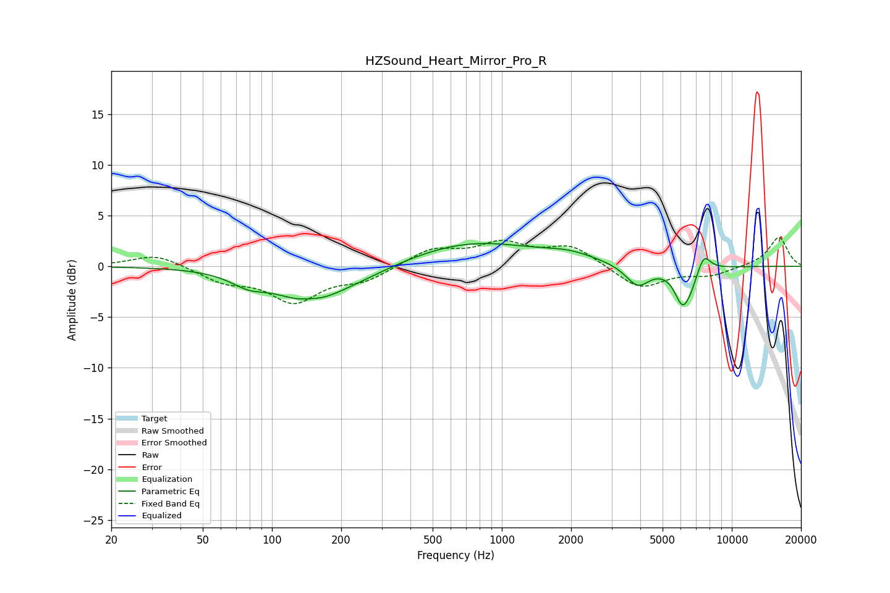

# HZSound_Heart_Mirror_Pro_R
See [usage instructions](https://github.com/jaakkopasanen/AutoEq#usage) for more options and info.

### Parametric EQs
Apply preamp of -2.3 dB when using parametric equalizer.

|   # | Type    |   Fc (Hz) |    Q |   Gain (dB) |
|-----|---------|-----------|------|-------------|
|   1 | Peaking |        79 | 1.81 |        -1.2 |
|   2 | Peaking |       145 | 1.03 |        -3.3 |
|   3 | Peaking |       146 | 2.53 |         0.4 |
|   4 | Peaking |       241 | 0.86 |        -0.9 |
|   5 | Peaking |       745 | 0.51 |         2.4 |
|   6 | Peaking |      1971 | 1.28 |         0.7 |
|   7 | Peaking |      3896 | 2.7  |        -2.1 |
|   8 | Peaking |      6123 | 3.82 |        -3.7 |
|   9 | Peaking |      6694 | 5.52 |        -0.7 |
|  10 | Peaking |      7568 | 4.73 |         1.7 |

### Fixed Band EQs
When using fixed band (also called graphic) equalizer, apply preamp of **-2.9 dB** (if available) and set gains manually with these parameters.

|   # | Type    |   Fc (Hz) |    Q |   Gain (dB) |
|-----|---------|-----------|------|-------------|
|   1 | Peaking |        31 | 1.41 |         1.2 |
|   2 | Peaking |        62 | 1.41 |        -1.4 |
|   3 | Peaking |       125 | 1.41 |        -3.3 |
|   4 | Peaking |       250 | 1.41 |        -1.3 |
|   5 | Peaking |       500 | 1.41 |         1.6 |
|   6 | Peaking |      1000 | 1.41 |         2.1 |
|   7 | Peaking |      2000 | 1.41 |         1.9 |
|   8 | Peaking |      4000 | 1.41 |        -2.3 |
|   9 | Peaking |      8000 | 1.41 |        -0.8 |
|  10 | Peaking |     16000 | 1.41 |         2.9 |

### Graphs

