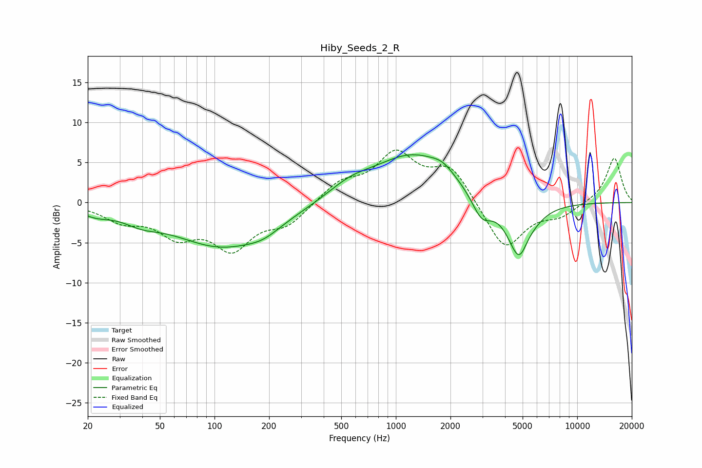

# Hiby_Seeds_2_R
See [usage instructions](https://github.com/jaakkopasanen/AutoEq#usage) for more options and info.

### Parametric EQs
Apply preamp of -6.1 dB when using parametric equalizer.

|   # | Type    |   Fc (Hz) |    Q |   Gain (dB) |
|-----|---------|-----------|------|-------------|
|   1 | Peaking |        22 | 1.79 |        -0.9 |
|   2 | Peaking |        39 | 1.42 |        -1.1 |
|   3 | Peaking |       110 | 0.52 |        -5.4 |
|   4 | Peaking |       186 | 1.54 |        -1   |
|   5 | Peaking |       559 | 1.13 |         1.6 |
|   6 | Peaking |      1242 | 0.65 |         5.8 |
|   7 | Peaking |      1814 | 2.24 |         1   |
|   8 | Peaking |      2972 | 2.57 |        -3   |
|   9 | Peaking |      4847 | 2.12 |        -8.3 |
|  10 | Peaking |      5177 | 3.21 |         1.5 |

### Fixed Band EQs
When using fixed band (also called graphic) equalizer, apply preamp of **-6.6 dB** (if available) and set gains manually with these parameters.

|   # | Type    |   Fc (Hz) |    Q |   Gain (dB) |
|-----|---------|-----------|------|-------------|
|   1 | Peaking |        31 | 1.41 |        -2   |
|   2 | Peaking |        62 | 1.41 |        -3.6 |
|   3 | Peaking |       125 | 1.41 |        -5.3 |
|   4 | Peaking |       250 | 1.41 |        -2.5 |
|   5 | Peaking |       500 | 1.41 |         2.3 |
|   6 | Peaking |      1000 | 1.41 |         5.7 |
|   7 | Peaking |      2000 | 1.41 |         4.3 |
|   8 | Peaking |      4000 | 1.41 |        -6   |
|   9 | Peaking |      8000 | 1.41 |        -1.5 |
|  10 | Peaking |     16000 | 1.41 |         5.7 |

### Graphs

