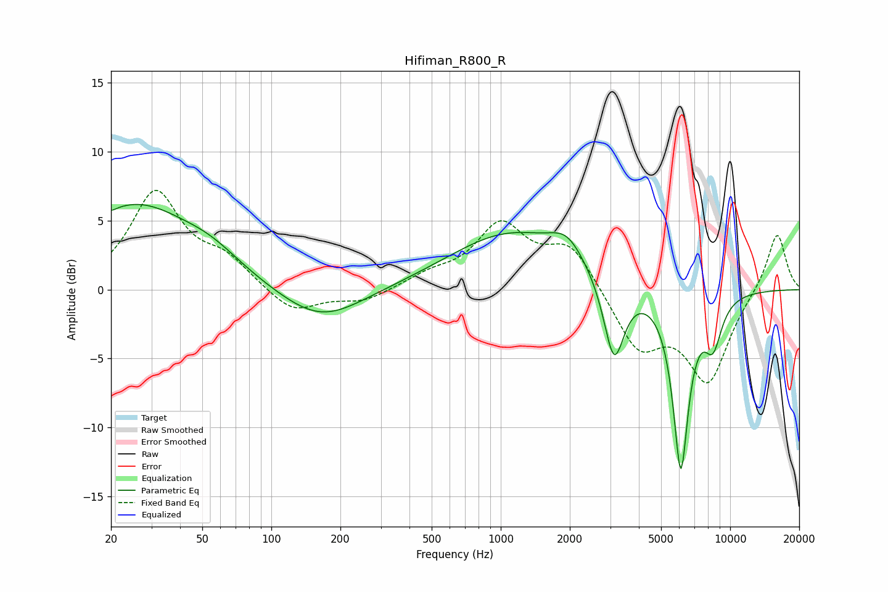

# Hifiman_R800_R
See [usage instructions](https://github.com/jaakkopasanen/AutoEq#usage) for more options and info.

### Parametric EQs
Apply preamp of -6.3 dB when using parametric equalizer.

|   # | Type    |   Fc (Hz) |    Q |   Gain (dB) |
|-----|---------|-----------|------|-------------|
|   1 | Peaking |        20 | 5.74 |         3.3 |
|   2 | Peaking |        20 | 5.96 |        -3.2 |
|   3 | Peaking |        25 | 0.55 |         6   |
|   4 | Peaking |        55 | 1.08 |         1.1 |
|   5 | Peaking |       164 | 0.78 |        -2.5 |
|   6 | Peaking |      1100 | 0.54 |         4   |
|   7 | Peaking |      1946 | 1.9  |         1.7 |
|   8 | Peaking |      3117 | 3.14 |        -6   |
|   9 | Peaking |      6094 | 3.9  |       -12.8 |
|  10 | Peaking |      8419 | 3.36 |        -3.2 |

### Fixed Band EQs
When using fixed band (also called graphic) equalizer, apply preamp of **-7.3 dB** (if available) and set gains manually with these parameters.

|   # | Type    |   Fc (Hz) |    Q |   Gain (dB) |
|-----|---------|-----------|------|-------------|
|   1 | Peaking |        31 | 1.41 |         6.9 |
|   2 | Peaking |        62 | 1.41 |         1.9 |
|   3 | Peaking |       125 | 1.41 |        -1.8 |
|   4 | Peaking |       250 | 1.41 |        -0.9 |
|   5 | Peaking |       500 | 1.41 |         0.9 |
|   6 | Peaking |      1000 | 1.41 |         4.5 |
|   7 | Peaking |      2000 | 1.41 |         3.2 |
|   8 | Peaking |      4000 | 1.41 |        -4.2 |
|   9 | Peaking |      8000 | 1.41 |        -6.5 |
|  10 | Peaking |     16000 | 1.41 |         4.3 |

### Graphs

