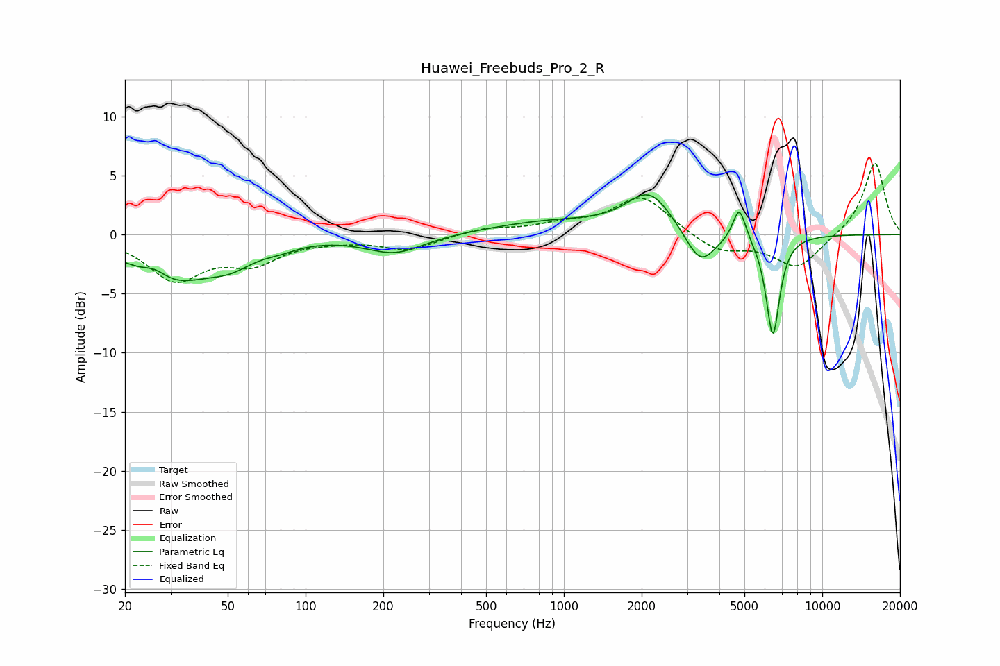

# Huawei_Freebuds_Pro_2_R
See [usage instructions](https://github.com/jaakkopasanen/AutoEq#usage) for more options and info.

### Parametric EQs
Apply preamp of -3.5 dB when using parametric equalizer.

|   # | Type    |   Fc (Hz) |    Q |   Gain (dB) |
|-----|---------|-----------|------|-------------|
|   1 | Peaking |        26 | 2.9  |         0.9 |
|   2 | Peaking |        30 | 0.9  |        -3.8 |
|   3 | Peaking |        51 | 1.49 |        -1.4 |
|   4 | Peaking |        80 | 2.24 |        -0.4 |
|   5 | Peaking |       222 | 1.25 |        -1.6 |
|   6 | Peaking |       895 | 0.6  |         1.1 |
|   7 | Peaking |      2148 | 1.6  |         3.4 |
|   8 | Peaking |      3376 | 2.38 |        -3.1 |
|   9 | Peaking |      4775 | 5.65 |         2.9 |
|  10 | Peaking |      6440 | 5.19 |        -8.6 |

### Fixed Band EQs
When using fixed band (also called graphic) equalizer, apply preamp of **-6.1 dB** (if available) and set gains manually with these parameters.

|   # | Type    |   Fc (Hz) |    Q |   Gain (dB) |
|-----|---------|-----------|------|-------------|
|   1 | Peaking |        31 | 1.41 |        -3.6 |
|   2 | Peaking |        62 | 1.41 |        -2.1 |
|   3 | Peaking |       125 | 1.41 |        -0.3 |
|   4 | Peaking |       250 | 1.41 |        -1.2 |
|   5 | Peaking |       500 | 1.41 |         0.5 |
|   6 | Peaking |      1000 | 1.41 |         0.7 |
|   7 | Peaking |      2000 | 1.41 |         3.3 |
|   8 | Peaking |      4000 | 1.41 |        -1.5 |
|   9 | Peaking |      8000 | 1.41 |        -2.8 |
|  10 | Peaking |     16000 | 1.41 |         6.2 |

### Graphs

