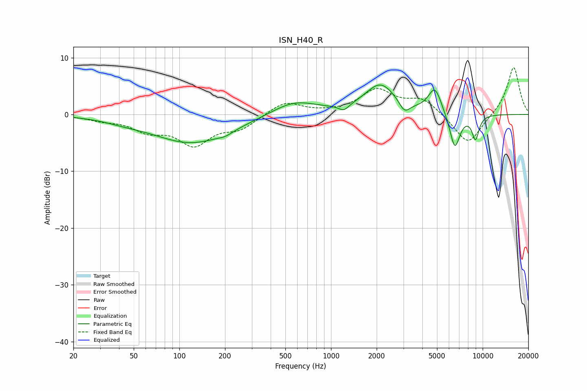

# ISN_H40_R
See [usage instructions](https://github.com/jaakkopasanen/AutoEq#usage) for more options and info.

### Parametric EQs
Apply preamp of -5.3 dB when using parametric equalizer.

|   # | Type    |   Fc (Hz) |    Q |   Gain (dB) |
|-----|---------|-----------|------|-------------|
|   1 | Peaking |        43 | 1.18 |        -0.5 |
|   2 | Peaking |       121 | 0.54 |        -5   |
|   3 | Peaking |       201 | 2.95 |        -0.5 |
|   4 | Peaking |       572 | 0.94 |         2.5 |
|   5 | Peaking |      1216 | 4.12 |        -1.1 |
|   6 | Peaking |      2119 | 1.38 |         5.2 |
|   7 | Peaking |      3053 | 4.06 |        -2   |
|   8 | Peaking |      4844 | 3.15 |         4.5 |
|   9 | Peaking |      6551 | 3.93 |        -6.3 |
|  10 | Peaking |      8971 | 5.48 |        -4.2 |

### Fixed Band EQs
When using fixed band (also called graphic) equalizer, apply preamp of **-8.3 dB** (if available) and set gains manually with these parameters.

|   # | Type    |   Fc (Hz) |    Q |   Gain (dB) |
|-----|---------|-----------|------|-------------|
|   1 | Peaking |        31 | 1.41 |        -0.8 |
|   2 | Peaking |        62 | 1.41 |        -2.5 |
|   3 | Peaking |       125 | 1.41 |        -4.9 |
|   4 | Peaking |       250 | 1.41 |        -2.2 |
|   5 | Peaking |       500 | 1.41 |         2.3 |
|   6 | Peaking |      1000 | 1.41 |         0.1 |
|   7 | Peaking |      2000 | 1.41 |         4.2 |
|   8 | Peaking |      4000 | 1.41 |         2.6 |
|   9 | Peaking |      8000 | 1.41 |        -5.5 |
|  10 | Peaking |     16000 | 1.41 |         8.5 |

### Graphs

