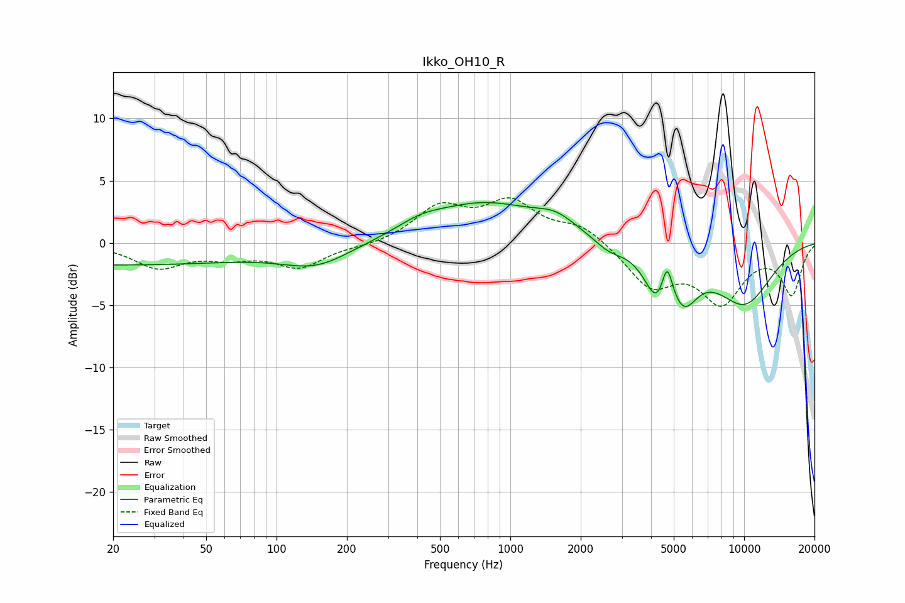

# Ikko_OH10_R
See [usage instructions](https://github.com/jaakkopasanen/AutoEq#usage) for more options and info.

### Parametric EQs
Apply preamp of -3.3 dB when using parametric equalizer.

|   # | Type    |   Fc (Hz) |    Q |   Gain (dB) |
|-----|---------|-----------|------|-------------|
|   1 | Peaking |        20 | 0.21 |        -1.7 |
|   2 | Peaking |       148 | 0.97 |        -1.6 |
|   3 | Peaking |       413 | 1.36 |         0.8 |
|   4 | Peaking |       779 | 0.61 |         3   |
|   5 | Peaking |      1562 | 1.59 |         1.2 |
|   6 | Peaking |      2648 | 2.26 |        -0.8 |
|   7 | Peaking |      4250 | 2.61 |        -3.4 |
|   8 | Peaking |      4681 | 6    |         3   |
|   9 | Peaking |      5528 | 2.31 |        -3.3 |
|  10 | Peaking |     10000 | 0.95 |        -4.7 |

### Fixed Band EQs
When using fixed band (also called graphic) equalizer, apply preamp of **-3.7 dB** (if available) and set gains manually with these parameters.

|   # | Type    |   Fc (Hz) |    Q |   Gain (dB) |
|-----|---------|-----------|------|-------------|
|   1 | Peaking |        31 | 1.41 |        -1.9 |
|   2 | Peaking |        62 | 1.41 |        -0.9 |
|   3 | Peaking |       125 | 1.41 |        -1.9 |
|   4 | Peaking |       250 | 1.41 |        -0.2 |
|   5 | Peaking |       500 | 1.41 |         2.7 |
|   6 | Peaking |      1000 | 1.41 |         3   |
|   7 | Peaking |      2000 | 1.41 |         1.4 |
|   8 | Peaking |      4000 | 1.41 |        -3.3 |
|   9 | Peaking |      8000 | 1.41 |        -4.5 |
|  10 | Peaking |     16000 | 1.41 |        -4   |

### Graphs

