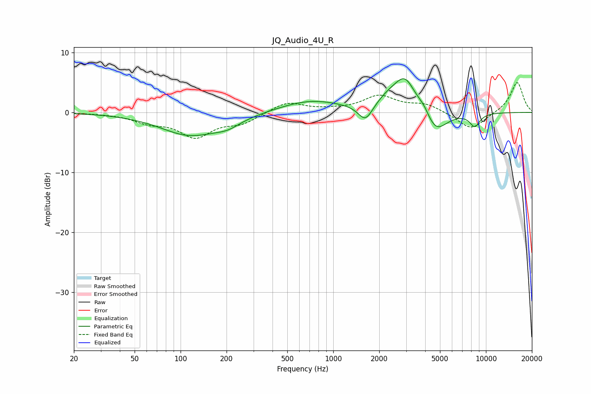

# JQ_Audio_4U_R
See [usage instructions](https://github.com/jaakkopasanen/AutoEq#usage) for more options and info.

### Parametric EQs
Apply preamp of -5.7 dB when using parametric equalizer.

|   # | Type    |   Fc (Hz) |    Q |   Gain (dB) |
|-----|---------|-----------|------|-------------|
|   1 | Peaking |       120 | 0.71 |        -4   |
|   2 | Peaking |       134 | 1.69 |         0.2 |
|   3 | Peaking |       205 | 1.84 |        -0.9 |
|   4 | Peaking |       711 | 0.69 |         2   |
|   5 | Peaking |      1626 | 2.99 |        -2.9 |
|   6 | Peaking |      2308 | 1.62 |         1.9 |
|   7 | Peaking |      2959 | 2.03 |         5.1 |
|   8 | Peaking |      3924 | 3.42 |         1.3 |
|   9 | Peaking |      4651 | 1.86 |        -3.9 |
|  10 | Peaking |      8455 | 3.87 |        -2.2 |

### Fixed Band EQs
When using fixed band (also called graphic) equalizer, apply preamp of **-5.1 dB** (if available) and set gains manually with these parameters.

|   # | Type    |   Fc (Hz) |    Q |   Gain (dB) |
|-----|---------|-----------|------|-------------|
|   1 | Peaking |        31 | 1.41 |        -0.1 |
|   2 | Peaking |        62 | 1.41 |        -1.4 |
|   3 | Peaking |       125 | 1.41 |        -3.8 |
|   4 | Peaking |       250 | 1.41 |        -1.6 |
|   5 | Peaking |       500 | 1.41 |         1.8 |
|   6 | Peaking |      1000 | 1.41 |         0.3 |
|   7 | Peaking |      2000 | 1.41 |         2.6 |
|   8 | Peaking |      4000 | 1.41 |         1.3 |
|   9 | Peaking |      8000 | 1.41 |        -3   |
|  10 | Peaking |     16000 | 1.41 |         5.1 |

### Graphs

