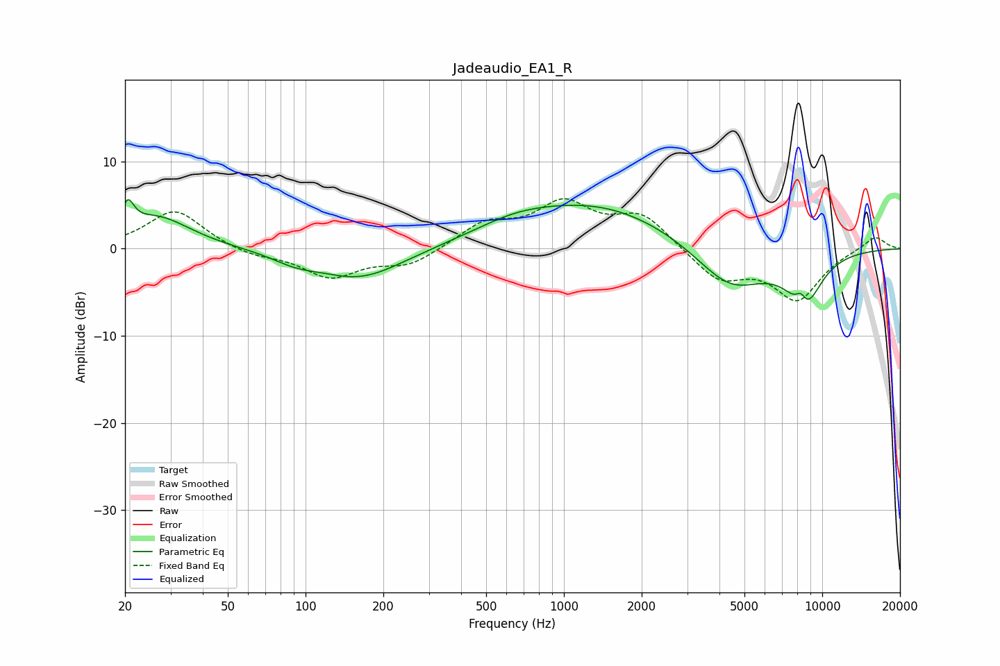

# Jadeaudio_EA1_R
See [usage instructions](https://github.com/jaakkopasanen/AutoEq#usage) for more options and info.

### Parametric EQs
Apply preamp of -5.7 dB when using parametric equalizer.

|   # | Type    |   Fc (Hz) |    Q |   Gain (dB) |
|-----|---------|-----------|------|-------------|
|   1 | Peaking |        20 | 6    |         2.9 |
|   2 | Peaking |        26 | 1.07 |         3.7 |
|   3 | Peaking |        91 | 1.66 |        -0.9 |
|   4 | Peaking |       162 | 0.83 |        -3.5 |
|   5 | Peaking |       639 | 0.93 |         1.2 |
|   6 | Peaking |      1337 | 0.45 |         5   |
|   7 | Peaking |      4403 | 1    |        -5.2 |
|   8 | Peaking |      8271 | 5.78 |         1.9 |
|   9 | Peaking |      8304 | 2.61 |         0.6 |
|  10 | Peaking |      8485 | 2.04 |        -6.8 |

### Fixed Band EQs
When using fixed band (also called graphic) equalizer, apply preamp of **-5.8 dB** (if available) and set gains manually with these parameters.

|   # | Type    |   Fc (Hz) |    Q |   Gain (dB) |
|-----|---------|-----------|------|-------------|
|   1 | Peaking |        31 | 1.41 |         4.5 |
|   2 | Peaking |        62 | 1.41 |        -0.8 |
|   3 | Peaking |       125 | 1.41 |        -3.2 |
|   4 | Peaking |       250 | 1.41 |        -1.9 |
|   5 | Peaking |       500 | 1.41 |         2.7 |
|   6 | Peaking |      1000 | 1.41 |         4.8 |
|   7 | Peaking |      2000 | 1.41 |         3.7 |
|   8 | Peaking |      4000 | 1.41 |        -3.5 |
|   9 | Peaking |      8000 | 1.41 |        -5.7 |
|  10 | Peaking |     16000 | 1.41 |         1.6 |

### Graphs

