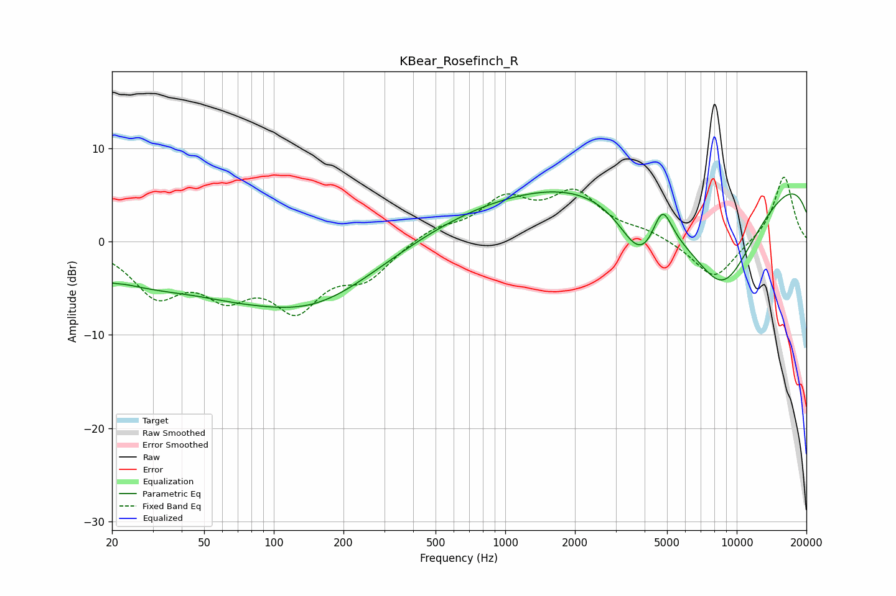

# KBear_Rosefinch_R
See [usage instructions](https://github.com/jaakkopasanen/AutoEq#usage) for more options and info.

### Parametric EQs
Apply preamp of -5.4 dB when using parametric equalizer.

|   # | Type    |   Fc (Hz) |    Q |   Gain (dB) |
|-----|---------|-----------|------|-------------|
|   1 | Peaking |        20 | 2.12 |        -0.7 |
|   2 | Peaking |        22 | 3.19 |         0.3 |
|   3 | Peaking |        45 | 1.25 |         0.3 |
|   4 | Peaking |        81 | 0.19 |        -6.1 |
|   5 | Peaking |       153 | 0.64 |        -2.1 |
|   6 | Peaking |       878 | 0.29 |         4.4 |
|   7 | Peaking |      3854 | 1.47 |        -5.9 |
|   8 | Peaking |      4770 | 3.34 |         4.2 |
|   9 | Peaking |      8668 | 0.65 |       -14.2 |
|  10 | Peaking |     10000 | 0.18 |        10.2 |

### Fixed Band EQs
When using fixed band (also called graphic) equalizer, apply preamp of **-7.0 dB** (if available) and set gains manually with these parameters.

|   # | Type    |   Fc (Hz) |    Q |   Gain (dB) |
|-----|---------|-----------|------|-------------|
|   1 | Peaking |        31 | 1.41 |        -5.2 |
|   2 | Peaking |        62 | 1.41 |        -4.6 |
|   3 | Peaking |       125 | 1.41 |        -6.3 |
|   4 | Peaking |       250 | 1.41 |        -3.4 |
|   5 | Peaking |       500 | 1.41 |         1.4 |
|   6 | Peaking |      1000 | 1.41 |         4.1 |
|   7 | Peaking |      2000 | 1.41 |         4.8 |
|   8 | Peaking |      4000 | 1.41 |         0.9 |
|   9 | Peaking |      8000 | 1.41 |        -4.2 |
|  10 | Peaking |     16000 | 1.41 |         7.1 |

### Graphs

