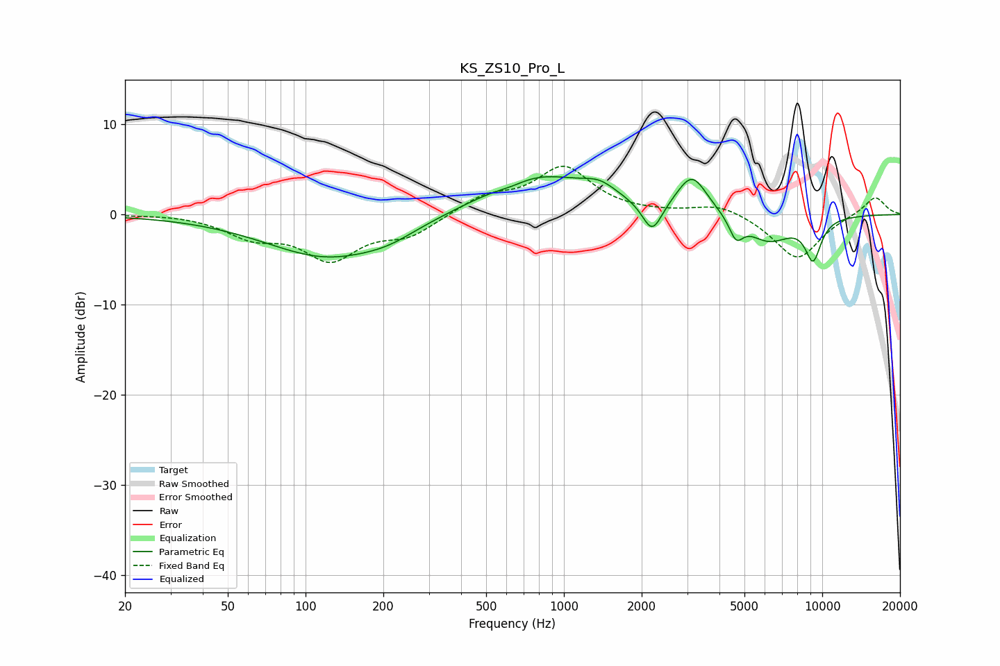

# KS_ZS10_Pro_L
See [usage instructions](https://github.com/jaakkopasanen/AutoEq#usage) for more options and info.

### Parametric EQs
Apply preamp of -4.3 dB when using parametric equalizer.

|   # | Type    |   Fc (Hz) |    Q |   Gain (dB) |
|-----|---------|-----------|------|-------------|
|   1 | Peaking |       122 | 0.59 |        -4.7 |
|   2 | Peaking |       210 | 1.37 |        -0.8 |
|   3 | Peaking |       623 | 2.34 |        -0.5 |
|   4 | Peaking |       783 | 0.67 |         4.5 |
|   5 | Peaking |      1375 | 2.15 |         1.3 |
|   6 | Peaking |      2198 | 3.67 |        -3.5 |
|   7 | Peaking |      3136 | 2.42 |         4.2 |
|   8 | Peaking |      4639 | 5.27 |        -2.3 |
|   9 | Peaking |      6205 | 1.53 |        -3   |
|  10 | Peaking |      9217 | 4.05 |        -4.4 |

### Fixed Band EQs
When using fixed band (also called graphic) equalizer, apply preamp of **-5.4 dB** (if available) and set gains manually with these parameters.

|   # | Type    |   Fc (Hz) |    Q |   Gain (dB) |
|-----|---------|-----------|------|-------------|
|   1 | Peaking |        31 | 1.41 |         0.1 |
|   2 | Peaking |        62 | 1.41 |        -2.2 |
|   3 | Peaking |       125 | 1.41 |        -4.6 |
|   4 | Peaking |       250 | 1.41 |        -2.1 |
|   5 | Peaking |       500 | 1.41 |         1.9 |
|   6 | Peaking |      1000 | 1.41 |         5.1 |
|   7 | Peaking |      2000 | 1.41 |         0   |
|   8 | Peaking |      4000 | 1.41 |         1.2 |
|   9 | Peaking |      8000 | 1.41 |        -5   |
|  10 | Peaking |     16000 | 1.41 |         2.1 |

### Graphs

