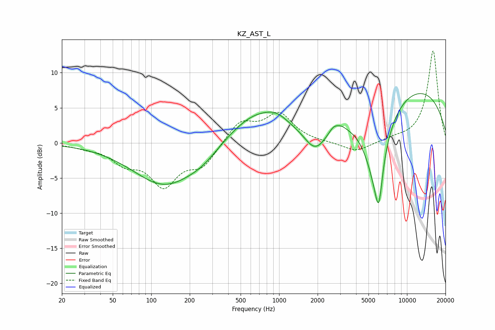

# KZ_AST_L
See [usage instructions](https://github.com/jaakkopasanen/AutoEq#usage) for more options and info.

### Parametric EQs
Apply preamp of -7.1 dB when using parametric equalizer.

|   # | Type    |   Fc (Hz) |    Q |   Gain (dB) |
|-----|---------|-----------|------|-------------|
|   1 | Peaking |       128 | 0.56 |        -6   |
|   2 | Peaking |       252 | 1.12 |        -1.2 |
|   3 | Peaking |       674 | 0.62 |         4.5 |
|   4 | Peaking |       953 | 1.87 |         0.8 |
|   5 | Peaking |      1919 | 1.6  |        -3.7 |
|   6 | Peaking |      2675 | 3.73 |         0.9 |
|   7 | Peaking |      3072 | 4.33 |         0.4 |
|   8 | Peaking |      5689 | 1.47 |       -10.7 |
|   9 | Peaking |      6014 | 5.1  |        -5.5 |
|  10 | Peaking |     10000 | 0.26 |         8.2 |

### Fixed Band EQs
When using fixed band (also called graphic) equalizer, apply preamp of **-13.2 dB** (if available) and set gains manually with these parameters.

|   # | Type    |   Fc (Hz) |    Q |   Gain (dB) |
|-----|---------|-----------|------|-------------|
|   1 | Peaking |        31 | 1.41 |        -0.5 |
|   2 | Peaking |        62 | 1.41 |        -2.5 |
|   3 | Peaking |       125 | 1.41 |        -5.6 |
|   4 | Peaking |       250 | 1.41 |        -3   |
|   5 | Peaking |       500 | 1.41 |         3   |
|   6 | Peaking |      1000 | 1.41 |         4   |
|   7 | Peaking |      2000 | 1.41 |         0   |
|   8 | Peaking |      4000 | 1.41 |        -1.4 |
|   9 | Peaking |      8000 | 1.41 |         0.4 |
|  10 | Peaking |     16000 | 1.41 |        13.2 |

### Graphs

