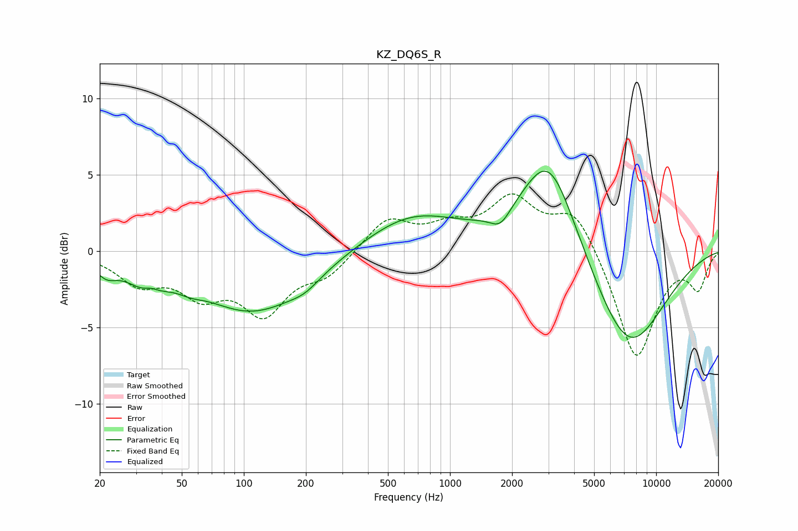

# KZ_DQ6S_R
See [usage instructions](https://github.com/jaakkopasanen/AutoEq#usage) for more options and info.

### Parametric EQs
Apply preamp of -5.3 dB when using parametric equalizer.

|   # | Type    |   Fc (Hz) |    Q |   Gain (dB) |
|-----|---------|-----------|------|-------------|
|   1 | Peaking |        22 | 2.84 |        -0.9 |
|   2 | Peaking |        34 | 1.49 |        -1.5 |
|   3 | Peaking |        35 | 4.3  |         0.3 |
|   4 | Peaking |        55 | 2.38 |        -0.4 |
|   5 | Peaking |       112 | 0.55 |        -3.9 |
|   6 | Peaking |       198 | 1.96 |        -0.5 |
|   7 | Peaking |       652 | 0.61 |         2.4 |
|   8 | Peaking |      1757 | 2.95 |        -1   |
|   9 | Peaking |      3020 | 1.03 |         6.8 |
|  10 | Peaking |      7302 | 0.75 |        -6.7 |

### Fixed Band EQs
When using fixed band (also called graphic) equalizer, apply preamp of **-3.8 dB** (if available) and set gains manually with these parameters.

|   # | Type    |   Fc (Hz) |    Q |   Gain (dB) |
|-----|---------|-----------|------|-------------|
|   1 | Peaking |        31 | 1.41 |        -1.9 |
|   2 | Peaking |        62 | 1.41 |        -2.4 |
|   3 | Peaking |       125 | 1.41 |        -3.7 |
|   4 | Peaking |       250 | 1.41 |        -1.4 |
|   5 | Peaking |       500 | 1.41 |         2.1 |
|   6 | Peaking |      1000 | 1.41 |         1.3 |
|   7 | Peaking |      2000 | 1.41 |         3.2 |
|   8 | Peaking |      4000 | 1.41 |         2.8 |
|   9 | Peaking |      8000 | 1.41 |        -7.2 |
|  10 | Peaking |     16000 | 1.41 |        -2.3 |

### Graphs

