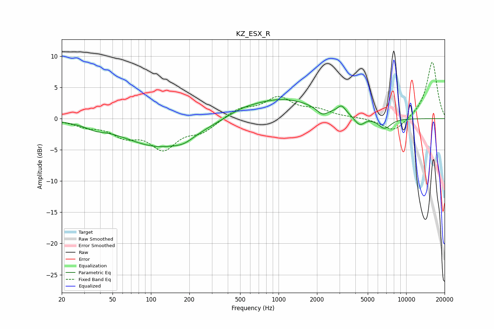

# KZ_ESX_R
See [usage instructions](https://github.com/jaakkopasanen/AutoEq#usage) for more options and info.

### Parametric EQs
Apply preamp of -3.2 dB when using parametric equalizer.

|   # | Type    |   Fc (Hz) |    Q |   Gain (dB) |
|-----|---------|-----------|------|-------------|
|   1 | Peaking |        36 | 2.04 |        -0.6 |
|   2 | Peaking |       117 | 0.51 |        -4.4 |
|   3 | Peaking |       181 | 1.91 |        -0.7 |
|   4 | Peaking |       515 | 1.35 |         0.5 |
|   5 | Peaking |      1052 | 0.51 |         3.2 |
|   6 | Peaking |      2199 | 3.32 |        -1.2 |
|   7 | Peaking |      3120 | 4.3  |         1.3 |
|   8 | Peaking |      4237 | 3.7  |        -1.2 |
|   9 | Peaking |      4526 | 5.09 |        -0.3 |
|  10 | Peaking |      6766 | 2.68 |        -1.7 |

### Fixed Band EQs
When using fixed band (also called graphic) equalizer, apply preamp of **-9.1 dB** (if available) and set gains manually with these parameters.

|   # | Type    |   Fc (Hz) |    Q |   Gain (dB) |
|-----|---------|-----------|------|-------------|
|   1 | Peaking |        31 | 1.41 |        -1   |
|   2 | Peaking |        62 | 1.41 |        -2.3 |
|   3 | Peaking |       125 | 1.41 |        -4.5 |
|   4 | Peaking |       250 | 1.41 |        -1.9 |
|   5 | Peaking |       500 | 1.41 |         1.6 |
|   6 | Peaking |      1000 | 1.41 |         3.2 |
|   7 | Peaking |      2000 | 1.41 |         1.2 |
|   8 | Peaking |      4000 | 1.41 |         0.1 |
|   9 | Peaking |      8000 | 1.41 |        -2.2 |
|  10 | Peaking |     16000 | 1.41 |         9.2 |

### Graphs

