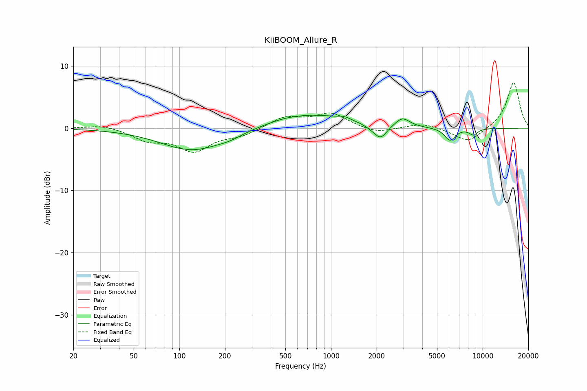

# KiiBOOM_Allure_R
See [usage instructions](https://github.com/jaakkopasanen/AutoEq#usage) for more options and info.

### Parametric EQs
Apply preamp of -2.2 dB when using parametric equalizer.

|   # | Type    |   Fc (Hz) |    Q |   Gain (dB) |
|-----|---------|-----------|------|-------------|
|   1 | Peaking |       122 | 0.68 |        -3.6 |
|   2 | Peaking |       216 | 1.84 |        -0.5 |
|   3 | Peaking |       483 | 1.8  |         0.1 |
|   4 | Peaking |       718 | 0.55 |         2.3 |
|   5 | Peaking |      1220 | 3.42 |         0.4 |
|   6 | Peaking |      1882 | 2.65 |        -0.5 |
|   7 | Peaking |      2130 | 3.43 |        -2   |
|   8 | Peaking |      2956 | 2.97 |         1.5 |
|   9 | Peaking |      6094 | 3.86 |        -2   |
|  10 | Peaking |      8691 | 4.58 |        -1   |

### Fixed Band EQs
When using fixed band (also called graphic) equalizer, apply preamp of **-7.4 dB** (if available) and set gains manually with these parameters.

|   # | Type    |   Fc (Hz) |    Q |   Gain (dB) |
|-----|---------|-----------|------|-------------|
|   1 | Peaking |        31 | 1.41 |         0.6 |
|   2 | Peaking |        62 | 1.41 |        -1.8 |
|   3 | Peaking |       125 | 1.41 |        -3.5 |
|   4 | Peaking |       250 | 1.41 |        -1.1 |
|   5 | Peaking |       500 | 1.41 |         1.8 |
|   6 | Peaking |      1000 | 1.41 |         2.3 |
|   7 | Peaking |      2000 | 1.41 |        -0.9 |
|   8 | Peaking |      4000 | 1.41 |         0.8 |
|   9 | Peaking |      8000 | 1.41 |        -2.4 |
|  10 | Peaking |     16000 | 1.41 |         7.5 |

### Graphs

