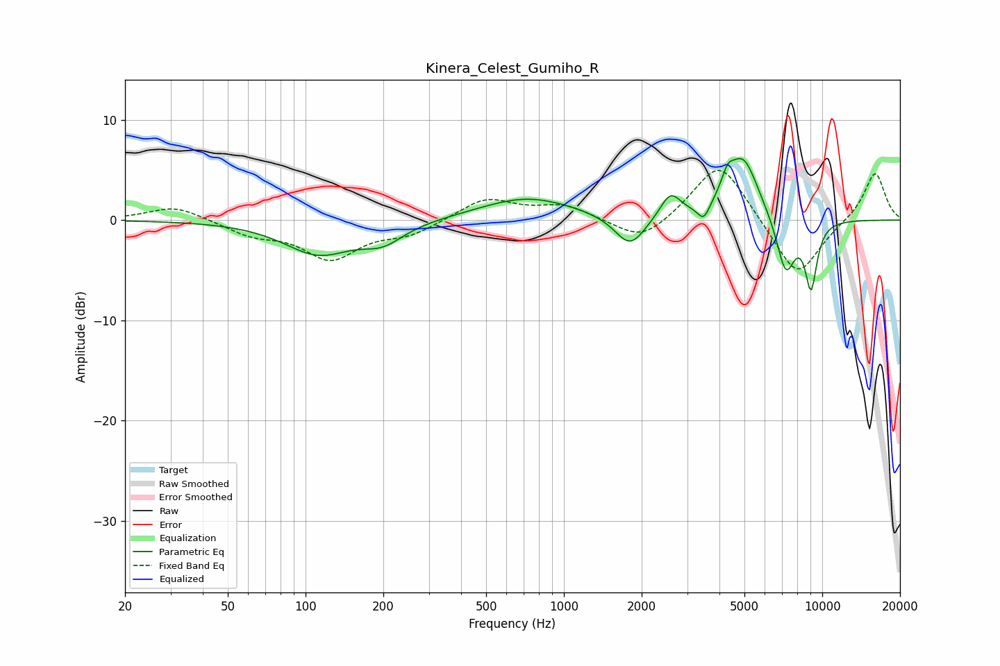

# Kinera_Celest_Gumiho_R
See [usage instructions](https://github.com/jaakkopasanen/AutoEq#usage) for more options and info.

### Parametric EQs
Apply preamp of -6.2 dB when using parametric equalizer.

|   # | Type    |   Fc (Hz) |    Q |   Gain (dB) |
|-----|---------|-----------|------|-------------|
|   1 | Peaking |       112 | 1.07 |        -3.3 |
|   2 | Peaking |       199 | 1.72 |        -1.8 |
|   3 | Peaking |       722 | 0.77 |         2.3 |
|   4 | Peaking |      1804 | 2.41 |        -3.2 |
|   5 | Peaking |      2586 | 3.59 |         2.5 |
|   6 | Peaking |      3476 | 5.96 |        -1.6 |
|   7 | Peaking |      4296 | 5.96 |         1.7 |
|   8 | Peaking |      4933 | 2.25 |         6.2 |
|   9 | Peaking |      7220 | 3.67 |        -5.6 |
|  10 | Peaking |      9052 | 5.46 |        -6.5 |

### Fixed Band EQs
When using fixed band (also called graphic) equalizer, apply preamp of **-5.0 dB** (if available) and set gains manually with these parameters.

|   # | Type    |   Fc (Hz) |    Q |   Gain (dB) |
|-----|---------|-----------|------|-------------|
|   1 | Peaking |        31 | 1.41 |         1.5 |
|   2 | Peaking |        62 | 1.41 |        -1.3 |
|   3 | Peaking |       125 | 1.41 |        -3.7 |
|   4 | Peaking |       250 | 1.41 |        -1.3 |
|   5 | Peaking |       500 | 1.41 |         2.2 |
|   6 | Peaking |      1000 | 1.41 |         1.4 |
|   7 | Peaking |      2000 | 1.41 |        -2.4 |
|   8 | Peaking |      4000 | 1.41 |         6.1 |
|   9 | Peaking |      8000 | 1.41 |        -6   |
|  10 | Peaking |     16000 | 1.41 |         4.9 |

### Graphs

