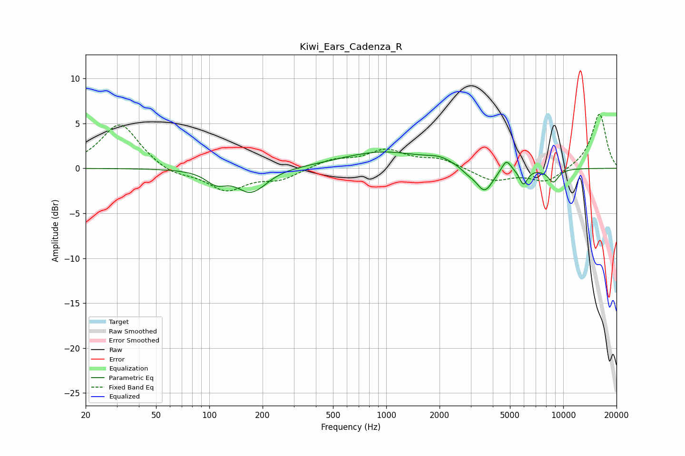

# Kiwi_Ears_Cadenza_R
See [usage instructions](https://github.com/jaakkopasanen/AutoEq#usage) for more options and info.

### Parametric EQs
Apply preamp of -1.9 dB when using parametric equalizer.

|   # | Type    |   Fc (Hz) |    Q |   Gain (dB) |
|-----|---------|-----------|------|-------------|
|   1 | Peaking |       109 | 2.42 |        -1.3 |
|   2 | Peaking |       175 | 1.82 |        -2.9 |
|   3 | Peaking |       180 | 3.66 |         0.3 |
|   4 | Peaking |       949 | 0.6  |         1.8 |
|   5 | Peaking |      2006 | 1.98 |         0.6 |
|   6 | Peaking |      2886 | 3.54 |        -0.5 |
|   7 | Peaking |      3593 | 2.94 |        -2.7 |
|   8 | Peaking |      4769 | 5.32 |         1.3 |
|   9 | Peaking |      5963 | 6    |        -1.7 |
|  10 | Peaking |      8790 | 4.19 |        -1.5 |

### Fixed Band EQs
When using fixed band (also called graphic) equalizer, apply preamp of **-6.1 dB** (if available) and set gains manually with these parameters.

|   # | Type    |   Fc (Hz) |    Q |   Gain (dB) |
|-----|---------|-----------|------|-------------|
|   1 | Peaking |        31 | 1.41 |         5.1 |
|   2 | Peaking |        62 | 1.41 |        -0.8 |
|   3 | Peaking |       125 | 1.41 |        -2.4 |
|   4 | Peaking |       250 | 1.41 |        -1.2 |
|   5 | Peaking |       500 | 1.41 |         0.9 |
|   6 | Peaking |      1000 | 1.41 |         1.9 |
|   7 | Peaking |      2000 | 1.41 |         1   |
|   8 | Peaking |      4000 | 1.41 |        -1.4 |
|   9 | Peaking |      8000 | 1.41 |        -1.5 |
|  10 | Peaking |     16000 | 1.41 |         6.1 |

### Graphs

