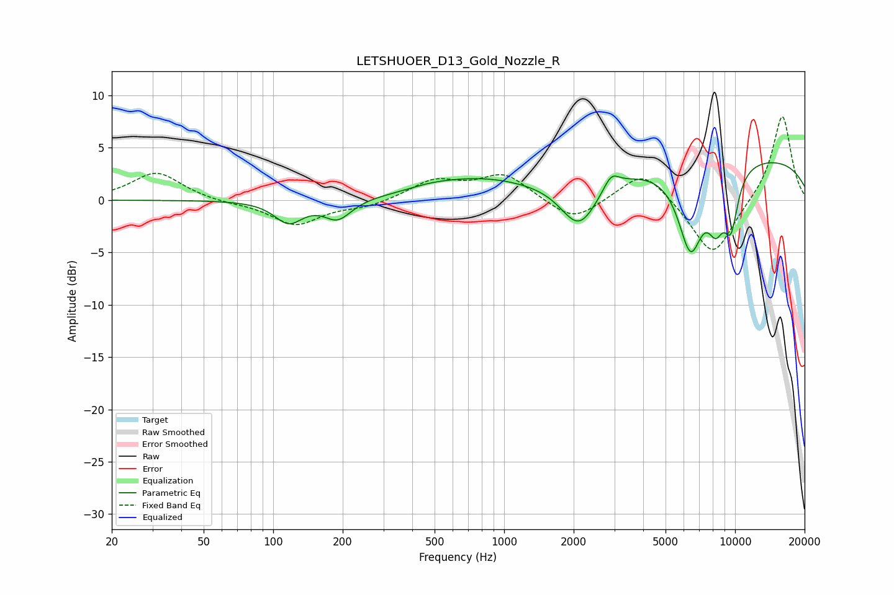

# LETSHUOER_D13_Gold_Nozzle_R
See [usage instructions](https://github.com/jaakkopasanen/AutoEq#usage) for more options and info.

### Parametric EQs
Apply preamp of -3.7 dB when using parametric equalizer.

|   # | Type    |   Fc (Hz) |    Q |   Gain (dB) |
|-----|---------|-----------|------|-------------|
|   1 | Peaking |       117 | 2.33 |        -2.1 |
|   2 | Peaking |       190 | 2.4  |        -1.9 |
|   3 | Peaking |       482 | 1.43 |         0.3 |
|   4 | Peaking |       758 | 0.63 |         1.8 |
|   5 | Peaking |      2112 | 1.76 |        -4.6 |
|   6 | Peaking |      2910 | 4.19 |         1.4 |
|   7 | Peaking |      6411 | 2.49 |        -7.9 |
|   8 | Peaking |      8262 | 3.48 |        -4   |
|   9 | Peaking |      9600 | 3.97 |        -5   |
|  10 | Peaking |      9792 | 0.19 |         4.3 |

### Fixed Band EQs
When using fixed band (also called graphic) equalizer, apply preamp of **-8.1 dB** (if available) and set gains manually with these parameters.

|   # | Type    |   Fc (Hz) |    Q |   Gain (dB) |
|-----|---------|-----------|------|-------------|
|   1 | Peaking |        31 | 1.41 |         2.7 |
|   2 | Peaking |        62 | 1.41 |        -0.2 |
|   3 | Peaking |       125 | 1.41 |        -2.4 |
|   4 | Peaking |       250 | 1.41 |        -0.6 |
|   5 | Peaking |       500 | 1.41 |         1.8 |
|   6 | Peaking |      1000 | 1.41 |         2.4 |
|   7 | Peaking |      2000 | 1.41 |        -2.2 |
|   8 | Peaking |      4000 | 1.41 |         3   |
|   9 | Peaking |      8000 | 1.41 |        -5.6 |
|  10 | Peaking |     16000 | 1.41 |         8.3 |

### Graphs

