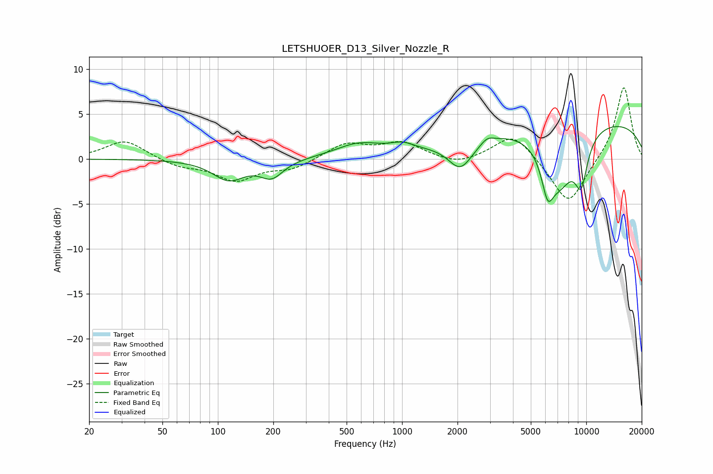

# LETSHUOER_D13_Silver_Nozzle_R
See [usage instructions](https://github.com/jaakkopasanen/AutoEq#usage) for more options and info.

### Parametric EQs
Apply preamp of -3.7 dB when using parametric equalizer.

|   # | Type    |   Fc (Hz) |    Q |   Gain (dB) |
|-----|---------|-----------|------|-------------|
|   1 | Peaking |       114 | 1.63 |        -2.2 |
|   2 | Peaking |       196 | 2.27 |        -1.9 |
|   3 | Peaking |       582 | 1.12 |         1.5 |
|   4 | Peaking |      1007 | 2.18 |         0.8 |
|   5 | Peaking |      2076 | 2.13 |        -3.1 |
|   6 | Peaking |      2898 | 4.15 |         0.6 |
|   7 | Peaking |      6166 | 4.31 |        -3.8 |
|   8 | Peaking |      7148 | 1.5  |        -6.2 |
|   9 | Peaking |      9389 | 3.58 |        -4.8 |
|  10 | Peaking |      9486 | 0.19 |         4.6 |

### Fixed Band EQs
When using fixed band (also called graphic) equalizer, apply preamp of **-8.0 dB** (if available) and set gains manually with these parameters.

|   # | Type    |   Fc (Hz) |    Q |   Gain (dB) |
|-----|---------|-----------|------|-------------|
|   1 | Peaking |        31 | 1.41 |         2.1 |
|   2 | Peaking |        62 | 1.41 |        -0.8 |
|   3 | Peaking |       125 | 1.41 |        -2.3 |
|   4 | Peaking |       250 | 1.41 |        -1   |
|   5 | Peaking |       500 | 1.41 |         1.7 |
|   6 | Peaking |      1000 | 1.41 |         1.7 |
|   7 | Peaking |      2000 | 1.41 |        -0.8 |
|   8 | Peaking |      4000 | 1.41 |         3   |
|   9 | Peaking |      8000 | 1.41 |        -5.2 |
|  10 | Peaking |     16000 | 1.41 |         8.2 |

### Graphs

