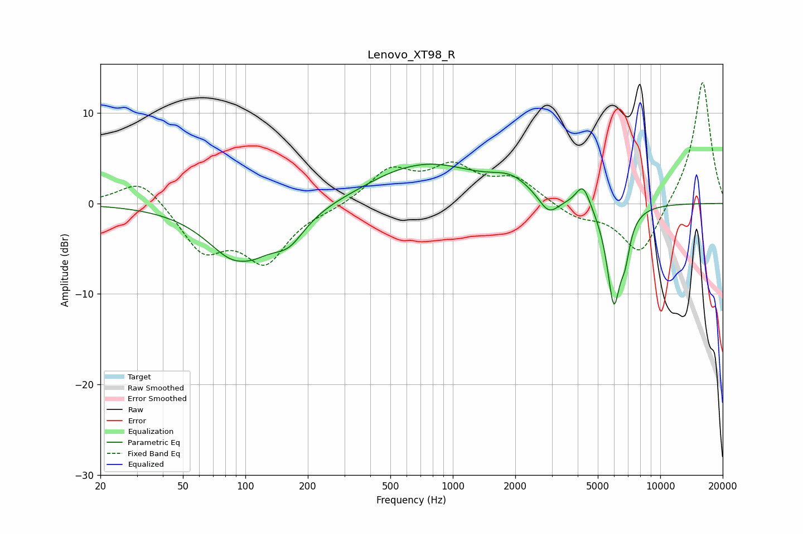

# Lenovo_XT98_R
See [usage instructions](https://github.com/jaakkopasanen/AutoEq#usage) for more options and info.

### Parametric EQs
Apply preamp of -4.4 dB when using parametric equalizer.

|   # | Type    |   Fc (Hz) |    Q |   Gain (dB) |
|-----|---------|-----------|------|-------------|
|   1 | Peaking |        94 | 1    |        -6.8 |
|   2 | Peaking |        95 | 2.36 |         0.7 |
|   3 | Peaking |       162 | 1.8  |        -2.6 |
|   4 | Peaking |       476 | 1.17 |         0.3 |
|   5 | Peaking |       763 | 0.56 |         4.2 |
|   6 | Peaking |      1916 | 1.48 |         1.7 |
|   7 | Peaking |      2899 | 2.92 |        -2.1 |
|   8 | Peaking |      4245 | 4.09 |         2.6 |
|   9 | Peaking |      5972 | 4.02 |       -10.8 |
|  10 | Peaking |      6773 | 5.94 |        -2.9 |

### Fixed Band EQs
When using fixed band (also called graphic) equalizer, apply preamp of **-13.5 dB** (if available) and set gains manually with these parameters.

|   # | Type    |   Fc (Hz) |    Q |   Gain (dB) |
|-----|---------|-----------|------|-------------|
|   1 | Peaking |        31 | 1.41 |         3   |
|   2 | Peaking |        62 | 1.41 |        -5   |
|   3 | Peaking |       125 | 1.41 |        -6.1 |
|   4 | Peaking |       250 | 1.41 |        -0.5 |
|   5 | Peaking |       500 | 1.41 |         3.6 |
|   6 | Peaking |      1000 | 1.41 |         3.6 |
|   7 | Peaking |      2000 | 1.41 |         2.5 |
|   8 | Peaking |      4000 | 1.41 |        -1.5 |
|   9 | Peaking |      8000 | 1.41 |        -5.9 |
|  10 | Peaking |     16000 | 1.41 |        13.8 |

### Graphs

