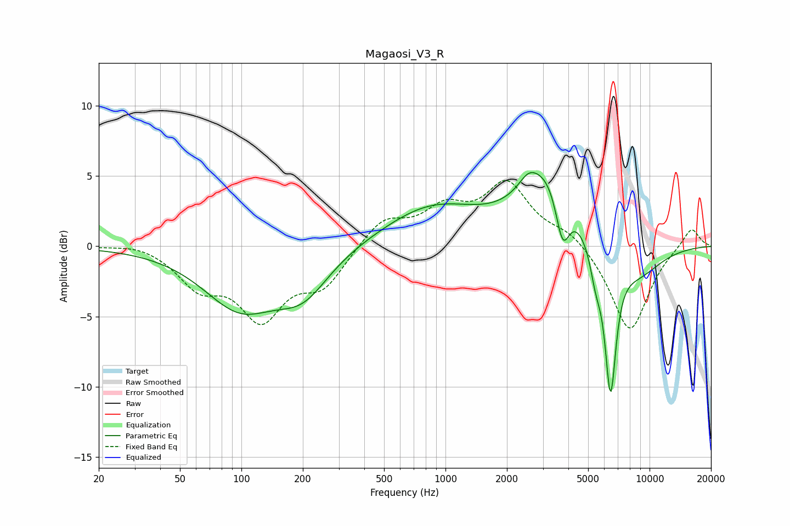

# Magaosi_V3_R
See [usage instructions](https://github.com/jaakkopasanen/AutoEq#usage) for more options and info.

### Parametric EQs
Apply preamp of -5.3 dB when using parametric equalizer.

|   # | Type    |   Fc (Hz) |    Q |   Gain (dB) |
|-----|---------|-----------|------|-------------|
|   1 | Peaking |        99 | 0.78 |        -4.2 |
|   2 | Peaking |       201 | 1.09 |        -2.7 |
|   3 | Peaking |       866 | 0.59 |         2.8 |
|   4 | Peaking |      2538 | 3.15 |         0.9 |
|   5 | Peaking |      3209 | 1.08 |         5.4 |
|   6 | Peaking |      3443 | 2.25 |        -0.3 |
|   7 | Peaking |      3752 | 4.11 |        -3.7 |
|   8 | Peaking |      5453 | 4.93 |        -2   |
|   9 | Peaking |      6438 | 4.85 |        -9.9 |
|  10 | Peaking |      8640 | 1.03 |        -2.1 |

### Fixed Band EQs
When using fixed band (also called graphic) equalizer, apply preamp of **-4.8 dB** (if available) and set gains manually with these parameters.

|   # | Type    |   Fc (Hz) |    Q |   Gain (dB) |
|-----|---------|-----------|------|-------------|
|   1 | Peaking |        31 | 1.41 |         0.3 |
|   2 | Peaking |        62 | 1.41 |        -2.5 |
|   3 | Peaking |       125 | 1.41 |        -4.7 |
|   4 | Peaking |       250 | 1.41 |        -2.6 |
|   5 | Peaking |       500 | 1.41 |         1.9 |
|   6 | Peaking |      1000 | 1.41 |         2.3 |
|   7 | Peaking |      2000 | 1.41 |         4.2 |
|   8 | Peaking |      4000 | 1.41 |         1   |
|   9 | Peaking |      8000 | 1.41 |        -6.2 |
|  10 | Peaking |     16000 | 1.41 |         1.5 |

### Graphs

