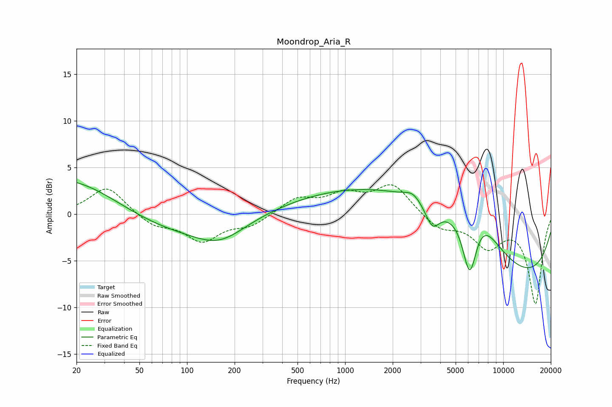

# Moondrop_Aria_R
See [usage instructions](https://github.com/jaakkopasanen/AutoEq#usage) for more options and info.

### Parametric EQs
Apply preamp of -3.5 dB when using parametric equalizer.

|   # | Type    |   Fc (Hz) |    Q |   Gain (dB) |
|-----|---------|-----------|------|-------------|
|   1 | Peaking |        20 | 0.39 |         6.6 |
|   2 | Peaking |        39 | 0.31 |        -3.8 |
|   3 | Peaking |       161 | 0.87 |        -2.3 |
|   4 | Peaking |      2689 | 2.68 |         0.9 |
|   5 | Peaking |      3182 | 0.24 |        13.4 |
|   6 | Peaking |      3554 | 3.76 |         1.6 |
|   7 | Peaking |      3561 | 3.34 |        -4   |
|   8 | Peaking |      6145 | 2.84 |        -7.4 |
|   9 | Peaking |      6212 | 0.18 |       -14   |
|  10 | Peaking |      6788 | 1.12 |         4.4 |

### Fixed Band EQs
When using fixed band (also called graphic) equalizer, apply preamp of **-3.2 dB** (if available) and set gains manually with these parameters.

|   # | Type    |   Fc (Hz) |    Q |   Gain (dB) |
|-----|---------|-----------|------|-------------|
|   1 | Peaking |        31 | 1.41 |         3   |
|   2 | Peaking |        62 | 1.41 |        -1.2 |
|   3 | Peaking |       125 | 1.41 |        -2.8 |
|   4 | Peaking |       250 | 1.41 |        -1.2 |
|   5 | Peaking |       500 | 1.41 |         1.6 |
|   6 | Peaking |      1000 | 1.41 |         1.9 |
|   7 | Peaking |      2000 | 1.41 |         3.1 |
|   8 | Peaking |      4000 | 1.41 |        -1.6 |
|   9 | Peaking |      8000 | 1.41 |        -3.2 |
|  10 | Peaking |     16000 | 1.41 |        -9.5 |

### Graphs

