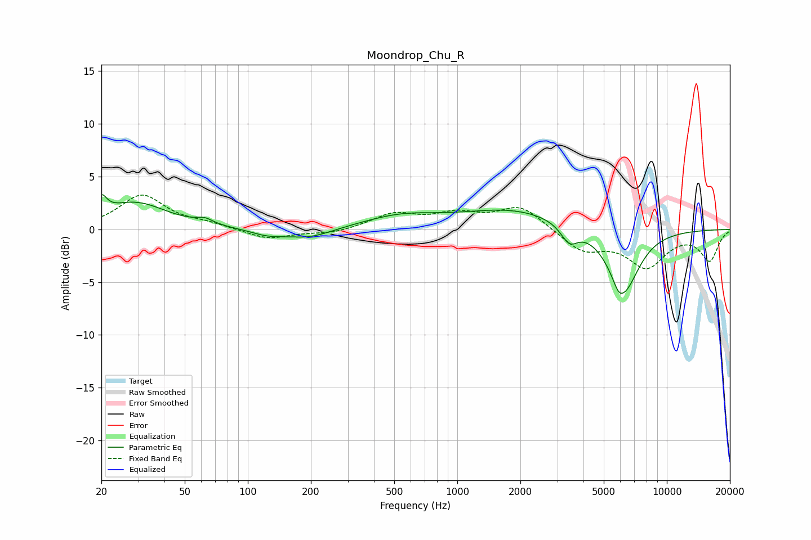

# Moondrop_Chu_R
See [usage instructions](https://github.com/jaakkopasanen/AutoEq#usage) for more options and info.

### Parametric EQs
Apply preamp of -3.4 dB when using parametric equalizer.

|   # | Type    |   Fc (Hz) |    Q |   Gain (dB) |
|-----|---------|-----------|------|-------------|
|   1 | Peaking |        20 | 5.78 |         1.6 |
|   2 | Peaking |        29 | 0.93 |         2.5 |
|   3 | Peaking |        62 | 3.66 |         0.5 |
|   4 | Peaking |       124 | 1.73 |        -0.5 |
|   5 | Peaking |       196 | 1.26 |        -0.9 |
|   6 | Peaking |       539 | 0.78 |         1.1 |
|   7 | Peaking |      1868 | 0.57 |         1.8 |
|   8 | Peaking |      3425 | 3.48 |        -1.7 |
|   9 | Peaking |      5890 | 6    |        -0.6 |
|  10 | Peaking |      6213 | 1.81 |        -6   |

### Fixed Band EQs
When using fixed band (also called graphic) equalizer, apply preamp of **-3.3 dB** (if available) and set gains manually with these parameters.

|   # | Type    |   Fc (Hz) |    Q |   Gain (dB) |
|-----|---------|-----------|------|-------------|
|   1 | Peaking |        31 | 1.41 |         3.2 |
|   2 | Peaking |        62 | 1.41 |         0.4 |
|   3 | Peaking |       125 | 1.41 |        -1   |
|   4 | Peaking |       250 | 1.41 |        -0.4 |
|   5 | Peaking |       500 | 1.41 |         1.4 |
|   6 | Peaking |      1000 | 1.41 |         1.3 |
|   7 | Peaking |      2000 | 1.41 |         2.2 |
|   8 | Peaking |      4000 | 1.41 |        -2   |
|   9 | Peaking |      8000 | 1.41 |        -3.4 |
|  10 | Peaking |     16000 | 1.41 |        -2.9 |

### Graphs

