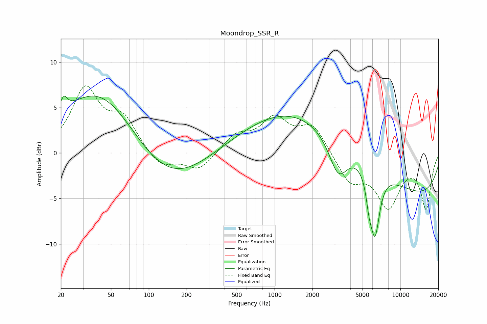

# Moondrop_SSR_R
See [usage instructions](https://github.com/jaakkopasanen/AutoEq#usage) for more options and info.

### Parametric EQs
Apply preamp of -6.4 dB when using parametric equalizer.

|   # | Type    |   Fc (Hz) |    Q |   Gain (dB) |
|-----|---------|-----------|------|-------------|
|   1 | Peaking |        21 | 4.98 |         1.6 |
|   2 | Peaking |        42 | 0.46 |         7.6 |
|   3 | Peaking |       138 | 0.46 |        -4.6 |
|   4 | Peaking |      1167 | 0.18 |         1.1 |
|   5 | Peaking |      2416 | 0.27 |         5.8 |
|   6 | Peaking |      3203 | 1.86 |        -4.2 |
|   7 | Peaking |      5629 | 6    |        -2   |
|   8 | Peaking |      6268 | 3.5  |        -7.3 |
|   9 | Peaking |      9064 | 0.19 |        -5.6 |
|  10 | Peaking |      9762 | 5.64 |        -0   |

### Fixed Band EQs
When using fixed band (also called graphic) equalizer, apply preamp of **-7.5 dB** (if available) and set gains manually with these parameters.

|   # | Type    |   Fc (Hz) |    Q |   Gain (dB) |
|-----|---------|-----------|------|-------------|
|   1 | Peaking |        31 | 1.41 |         6.8 |
|   2 | Peaking |        62 | 1.41 |         3.5 |
|   3 | Peaking |       125 | 1.41 |        -1.7 |
|   4 | Peaking |       250 | 1.41 |        -1.9 |
|   5 | Peaking |       500 | 1.41 |         1.9 |
|   6 | Peaking |      1000 | 1.41 |         3.5 |
|   7 | Peaking |      2000 | 1.41 |         3   |
|   8 | Peaking |      4000 | 1.41 |        -3.1 |
|   9 | Peaking |      8000 | 1.41 |        -5.5 |
|  10 | Peaking |     16000 | 1.41 |        -5.9 |

### Graphs

