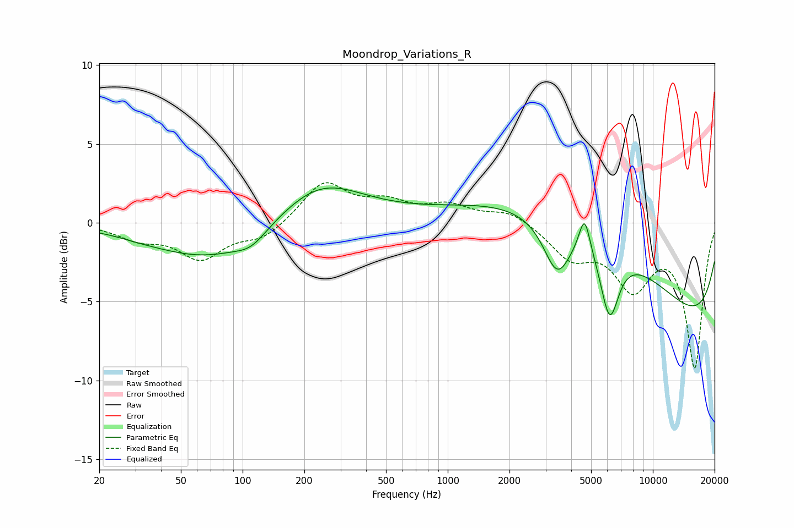

# Moondrop_Variations_R
See [usage instructions](https://github.com/jaakkopasanen/AutoEq#usage) for more options and info.

### Parametric EQs
Apply preamp of -2.3 dB when using parametric equalizer.

|   # | Type    |   Fc (Hz) |    Q |   Gain (dB) |
|-----|---------|-----------|------|-------------|
|   1 | Peaking |        32 | 1.42 |        -0.1 |
|   2 | Peaking |        71 | 0.5  |        -2.4 |
|   3 | Peaking |       110 | 1.94 |        -0.7 |
|   4 | Peaking |       235 | 0.68 |         2.7 |
|   5 | Peaking |      1669 | 0.23 |         0.4 |
|   6 | Peaking |      3415 | 2.13 |        -3.4 |
|   7 | Peaking |      4645 | 5.17 |         2.3 |
|   8 | Peaking |      4988 | 0.31 |         6.3 |
|   9 | Peaking |      6156 | 3.05 |        -4.5 |
|  10 | Peaking |      9995 | 0.19 |        -8.1 |

### Fixed Band EQs
When using fixed band (also called graphic) equalizer, apply preamp of **-2.6 dB** (if available) and set gains manually with these parameters.

|   # | Type    |   Fc (Hz) |    Q |   Gain (dB) |
|-----|---------|-----------|------|-------------|
|   1 | Peaking |        31 | 1.41 |        -0.9 |
|   2 | Peaking |        62 | 1.41 |        -2.2 |
|   3 | Peaking |       125 | 1.41 |        -1   |
|   4 | Peaking |       250 | 1.41 |         2.5 |
|   5 | Peaking |       500 | 1.41 |         1.1 |
|   6 | Peaking |      1000 | 1.41 |         1   |
|   7 | Peaking |      2000 | 1.41 |         0.8 |
|   8 | Peaking |      4000 | 1.41 |        -2   |
|   9 | Peaking |      8000 | 1.41 |        -3.8 |
|  10 | Peaking |     16000 | 1.41 |        -9.1 |

### Graphs

