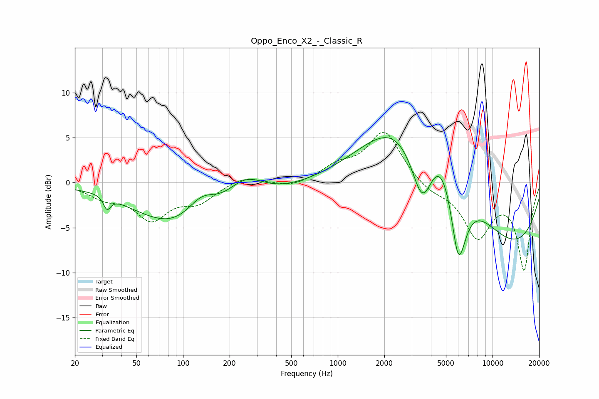

# Oppo_Enco_X2_-_Classic_R
See [usage instructions](https://github.com/jaakkopasanen/AutoEq#usage) for more options and info.

### Parametric EQs
Apply preamp of -5.1 dB when using parametric equalizer.

|   # | Type    |   Fc (Hz) |    Q |   Gain (dB) |
|-----|---------|-----------|------|-------------|
|   1 | Peaking |        31 | 1.8  |         0.4 |
|   2 | Peaking |        32 | 6    |        -1.5 |
|   3 | Peaking |       130 | 0.42 |        -7.1 |
|   4 | Peaking |       132 | 1.26 |         3.9 |
|   5 | Peaking |       248 | 1.01 |         4.3 |
|   6 | Peaking |      2458 | 0.58 |         5.2 |
|   7 | Peaking |      3528 | 1.67 |        -9.5 |
|   8 | Peaking |      4768 | 0.63 |        13.6 |
|   9 | Peaking |      6007 | 2.28 |       -11.7 |
|  10 | Peaking |     10000 | 0.27 |        -9.3 |

### Fixed Band EQs
When using fixed band (also called graphic) equalizer, apply preamp of **-5.7 dB** (if available) and set gains manually with these parameters.

|   # | Type    |   Fc (Hz) |    Q |   Gain (dB) |
|-----|---------|-----------|------|-------------|
|   1 | Peaking |        31 | 1.41 |        -1.4 |
|   2 | Peaking |        62 | 1.41 |        -3.8 |
|   3 | Peaking |       125 | 1.41 |        -1.9 |
|   4 | Peaking |       250 | 1.41 |         0.8 |
|   5 | Peaking |       500 | 1.41 |        -0.6 |
|   6 | Peaking |      1000 | 1.41 |         1.6 |
|   7 | Peaking |      2000 | 1.41 |         5.7 |
|   8 | Peaking |      4000 | 1.41 |        -1   |
|   9 | Peaking |      8000 | 1.41 |        -5.8 |
|  10 | Peaking |     16000 | 1.41 |        -9.5 |

### Graphs

