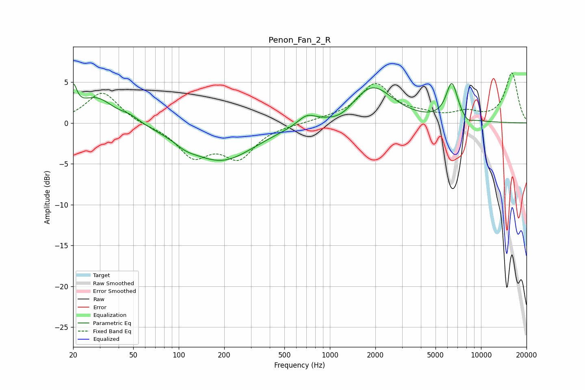

# Penon_Fan_2_R
See [usage instructions](https://github.com/jaakkopasanen/AutoEq#usage) for more options and info.

### Parametric EQs
Apply preamp of -4.9 dB when using parametric equalizer.

|   # | Type    |   Fc (Hz) |    Q |   Gain (dB) |
|-----|---------|-----------|------|-------------|
|   1 | Peaking |        20 | 5.96 |         3.1 |
|   2 | Peaking |        28 | 1.23 |         3.1 |
|   3 | Peaking |        48 | 2.24 |         0.6 |
|   4 | Peaking |       111 | 2.01 |        -0.7 |
|   5 | Peaking |       191 | 0.64 |        -4.6 |
|   6 | Peaking |       702 | 2.36 |         1.2 |
|   7 | Peaking |      1194 | 1.73 |        -1   |
|   8 | Peaking |      1900 | 1.03 |         4.6 |
|   9 | Peaking |      6413 | 3.51 |         4.6 |
|  10 | Peaking |      8119 | 3.93 |        -0.6 |

### Fixed Band EQs
When using fixed band (also called graphic) equalizer, apply preamp of **-6.2 dB** (if available) and set gains manually with these parameters.

|   # | Type    |   Fc (Hz) |    Q |   Gain (dB) |
|-----|---------|-----------|------|-------------|
|   1 | Peaking |        31 | 1.41 |         3.8 |
|   2 | Peaking |        62 | 1.41 |        -0.3 |
|   3 | Peaking |       125 | 1.41 |        -3.8 |
|   4 | Peaking |       250 | 1.41 |        -3.9 |
|   5 | Peaking |       500 | 1.41 |        -0.1 |
|   6 | Peaking |      1000 | 1.41 |         0.4 |
|   7 | Peaking |      2000 | 1.41 |         4.6 |
|   8 | Peaking |      4000 | 1.41 |         0.7 |
|   9 | Peaking |      8000 | 1.41 |         1.1 |
|  10 | Peaking |     16000 | 1.41 |         6.1 |

### Graphs

