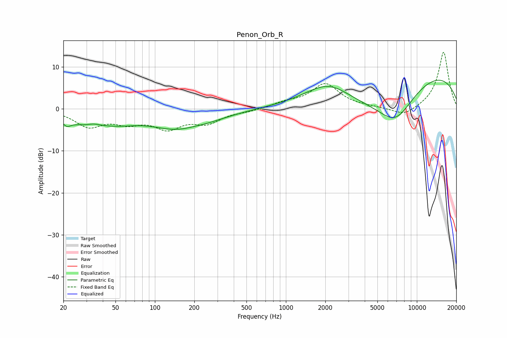

# Penon_Orb_R
See [usage instructions](https://github.com/jaakkopasanen/AutoEq#usage) for more options and info.

### Parametric EQs
Apply preamp of -6.9 dB when using parametric equalizer.

|   # | Type    |   Fc (Hz) |    Q |   Gain (dB) |
|-----|---------|-----------|------|-------------|
|   1 | Peaking |        21 | 4.8  |        -1.4 |
|   2 | Peaking |        31 | 0.79 |        -3.7 |
|   3 | Peaking |        34 | 2.29 |         1   |
|   4 | Peaking |        56 | 1.16 |        -0.9 |
|   5 | Peaking |       163 | 0.6  |        -5   |
|   6 | Peaking |       192 | 1.44 |         0.6 |
|   7 | Peaking |      2110 | 0.82 |         5.2 |
|   8 | Peaking |      3717 | 0.38 |        -7.6 |
|   9 | Peaking |      6872 | 0.94 |        -7.9 |
|  10 | Peaking |      7790 | 0.18 |        11.1 |

### Fixed Band EQs
When using fixed band (also called graphic) equalizer, apply preamp of **-13.6 dB** (if available) and set gains manually with these parameters.

|   # | Type    |   Fc (Hz) |    Q |   Gain (dB) |
|-----|---------|-----------|------|-------------|
|   1 | Peaking |        31 | 1.41 |        -3.9 |
|   2 | Peaking |        62 | 1.41 |        -2.7 |
|   3 | Peaking |       125 | 1.41 |        -4.1 |
|   4 | Peaking |       250 | 1.41 |        -3   |
|   5 | Peaking |       500 | 1.41 |        -0.5 |
|   6 | Peaking |      1000 | 1.41 |         1.3 |
|   7 | Peaking |      2000 | 1.41 |         5.8 |
|   8 | Peaking |      4000 | 1.41 |         0.2 |
|   9 | Peaking |      8000 | 1.41 |        -2   |
|  10 | Peaking |     16000 | 1.41 |        13.7 |

### Graphs

