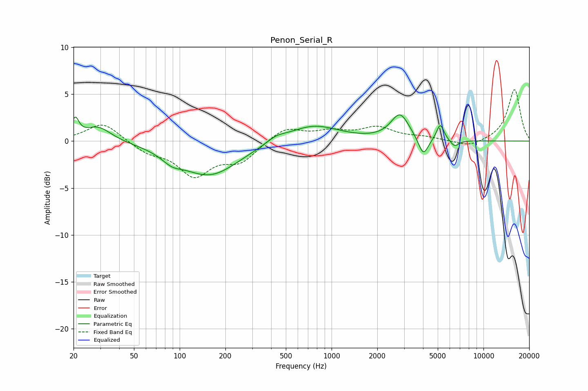

# Penon_Serial_R
See [usage instructions](https://github.com/jaakkopasanen/AutoEq#usage) for more options and info.

### Parametric EQs
Apply preamp of -2.9 dB when using parametric equalizer.

|   # | Type    |   Fc (Hz) |    Q |   Gain (dB) |
|-----|---------|-----------|------|-------------|
|   1 | Peaking |        21 | 5.95 |         2   |
|   2 | Peaking |        29 | 1.59 |         1.6 |
|   3 | Peaking |        89 | 2.18 |        -0.8 |
|   4 | Peaking |       157 | 0.74 |        -3.6 |
|   5 | Peaking |       432 | 2.26 |         0.5 |
|   6 | Peaking |       755 | 0.84 |         1.8 |
|   7 | Peaking |      2821 | 2.37 |         2.8 |
|   8 | Peaking |      4017 | 4.3  |        -2   |
|   9 | Peaking |      5194 | 5.66 |         1.8 |
|  10 | Peaking |      6454 | 4.78 |        -0.7 |

### Fixed Band EQs
When using fixed band (also called graphic) equalizer, apply preamp of **-5.6 dB** (if available) and set gains manually with these parameters.

|   # | Type    |   Fc (Hz) |    Q |   Gain (dB) |
|-----|---------|-----------|------|-------------|
|   1 | Peaking |        31 | 1.41 |         2   |
|   2 | Peaking |        62 | 1.41 |        -1.1 |
|   3 | Peaking |       125 | 1.41 |        -3.5 |
|   4 | Peaking |       250 | 1.41 |        -2   |
|   5 | Peaking |       500 | 1.41 |         1.5 |
|   6 | Peaking |      1000 | 1.41 |         0.9 |
|   7 | Peaking |      2000 | 1.41 |         1.3 |
|   8 | Peaking |      4000 | 1.41 |         0.3 |
|   9 | Peaking |      8000 | 1.41 |        -0.7 |
|  10 | Peaking |     16000 | 1.41 |         5.5 |

### Graphs

