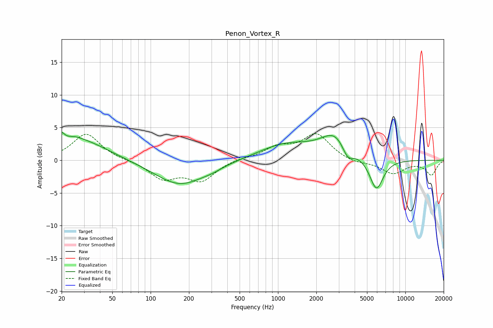

# Penon_Vortex_R
See [usage instructions](https://github.com/jaakkopasanen/AutoEq#usage) for more options and info.

### Parametric EQs
Apply preamp of -4.3 dB when using parametric equalizer.

|   # | Type    |   Fc (Hz) |    Q |   Gain (dB) |
|-----|---------|-----------|------|-------------|
|   1 | Peaking |        20 | 5.97 |         3.1 |
|   2 | Peaking |        20 | 6    |        -1.6 |
|   3 | Peaking |        25 | 2.13 |         0.7 |
|   4 | Peaking |        29 | 0.67 |         3   |
|   5 | Peaking |       170 | 0.71 |        -3.8 |
|   6 | Peaking |       307 | 1.85 |        -0.3 |
|   7 | Peaking |      1158 | 0.66 |         2.4 |
|   8 | Peaking |      2833 | 1.27 |         3.7 |
|   9 | Peaking |      3520 | 3.11 |        -2.2 |
|  10 | Peaking |      5925 | 2.55 |        -4.9 |

### Fixed Band EQs
When using fixed band (also called graphic) equalizer, apply preamp of **-4.2 dB** (if available) and set gains manually with these parameters.

|   # | Type    |   Fc (Hz) |    Q |   Gain (dB) |
|-----|---------|-----------|------|-------------|
|   1 | Peaking |        31 | 1.41 |         4.1 |
|   2 | Peaking |        62 | 1.41 |        -0   |
|   3 | Peaking |       125 | 1.41 |        -2.7 |
|   4 | Peaking |       250 | 1.41 |        -3   |
|   5 | Peaking |       500 | 1.41 |         0.3 |
|   6 | Peaking |      1000 | 1.41 |         1.8 |
|   7 | Peaking |      2000 | 1.41 |         3.9 |
|   8 | Peaking |      4000 | 1.41 |        -0.5 |
|   9 | Peaking |      8000 | 1.41 |        -2   |
|  10 | Peaking |     16000 | 1.41 |        -2.2 |

### Graphs

