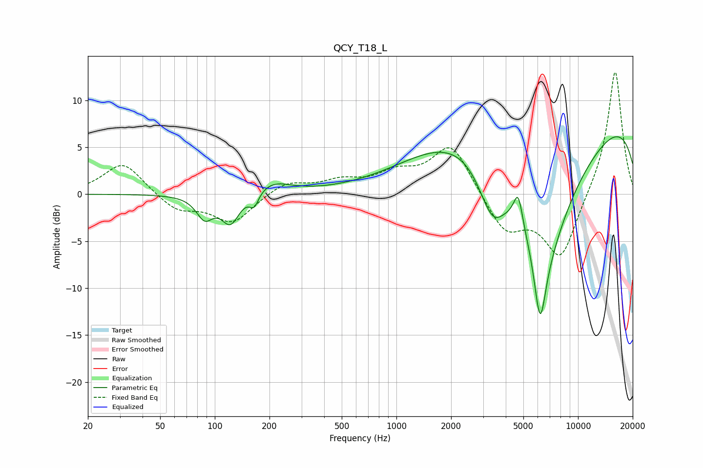

# QCY_T18_L
See [usage instructions](https://github.com/jaakkopasanen/AutoEq#usage) for more options and info.

### Parametric EQs
Apply preamp of -6.2 dB when using parametric equalizer.

|   # | Type    |   Fc (Hz) |    Q |   Gain (dB) |
|-----|---------|-----------|------|-------------|
|   1 | Peaking |        88 | 3.14 |        -2.3 |
|   2 | Peaking |       122 | 2.83 |        -3.1 |
|   3 | Peaking |       165 | 5.68 |        -1.5 |
|   4 | Peaking |       207 | 1.44 |         1.3 |
|   5 | Peaking |      2507 | 0.43 |         4.6 |
|   6 | Peaking |      3379 | 1.78 |        -5.8 |
|   7 | Peaking |      4683 | 5.7  |         3.3 |
|   8 | Peaking |      6183 | 4.33 |        -7.4 |
|   9 | Peaking |      6475 | 0.71 |       -16.5 |
|  10 | Peaking |     10000 | 0.18 |         9.9 |

### Fixed Band EQs
When using fixed band (also called graphic) equalizer, apply preamp of **-13.1 dB** (if available) and set gains manually with these parameters.

|   # | Type    |   Fc (Hz) |    Q |   Gain (dB) |
|-----|---------|-----------|------|-------------|
|   1 | Peaking |        31 | 1.41 |         3.4 |
|   2 | Peaking |        62 | 1.41 |        -1.8 |
|   3 | Peaking |       125 | 1.41 |        -3   |
|   4 | Peaking |       250 | 1.41 |         1.3 |
|   5 | Peaking |       500 | 1.41 |         1.2 |
|   6 | Peaking |      1000 | 1.41 |         1.9 |
|   7 | Peaking |      2000 | 1.41 |         5.4 |
|   8 | Peaking |      4000 | 1.41 |        -4   |
|   9 | Peaking |      8000 | 1.41 |        -6.9 |
|  10 | Peaking |     16000 | 1.41 |        13.5 |

### Graphs

