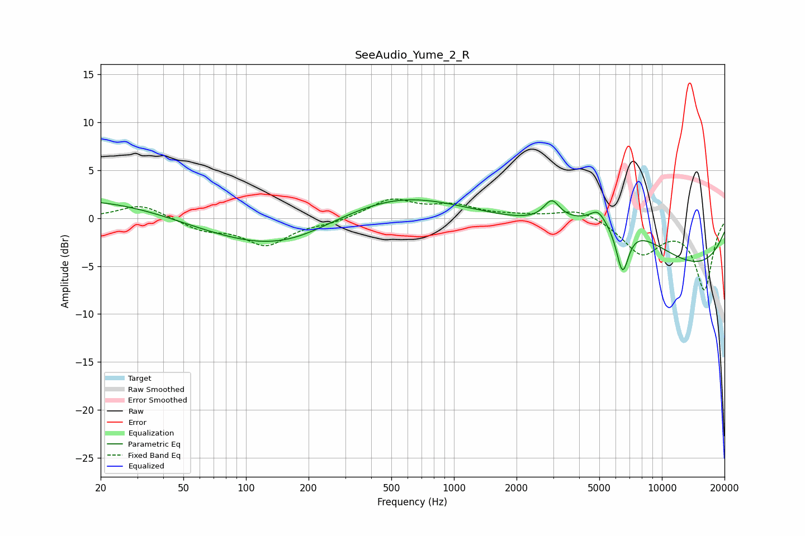

# SeeAudio_Yume_2_R
See [usage instructions](https://github.com/jaakkopasanen/AutoEq#usage) for more options and info.

### Parametric EQs
Apply preamp of -2.0 dB when using parametric equalizer.

|   # | Type    |   Fc (Hz) |    Q |   Gain (dB) |
|-----|---------|-----------|------|-------------|
|   1 | Peaking |        20 | 0.31 |         2.2 |
|   2 | Peaking |       138 | 0.79 |        -0.7 |
|   3 | Peaking |       139 | 0.3  |        -3.2 |
|   4 | Peaking |       185 | 1.41 |        -0.1 |
|   5 | Peaking |       476 | 0.45 |         3.5 |
|   6 | Peaking |      2954 | 3.71 |         2   |
|   7 | Peaking |      4920 | 3.95 |         1.2 |
|   8 | Peaking |      6080 | 0.52 |         5.4 |
|   9 | Peaking |      6465 | 4.45 |        -5   |
|  10 | Peaking |     10000 | 0.24 |        -6.6 |

### Fixed Band EQs
When using fixed band (also called graphic) equalizer, apply preamp of **-2.1 dB** (if available) and set gains manually with these parameters.

|   # | Type    |   Fc (Hz) |    Q |   Gain (dB) |
|-----|---------|-----------|------|-------------|
|   1 | Peaking |        31 | 1.41 |         1.5 |
|   2 | Peaking |        62 | 1.41 |        -1.1 |
|   3 | Peaking |       125 | 1.41 |        -2.7 |
|   4 | Peaking |       250 | 1.41 |        -0.4 |
|   5 | Peaking |       500 | 1.41 |         1.9 |
|   6 | Peaking |      1000 | 1.41 |         1.2 |
|   7 | Peaking |      2000 | 1.41 |         0.2 |
|   8 | Peaking |      4000 | 1.41 |         1.1 |
|   9 | Peaking |      8000 | 1.41 |        -3.6 |
|  10 | Peaking |     16000 | 1.41 |        -7.3 |

### Graphs

