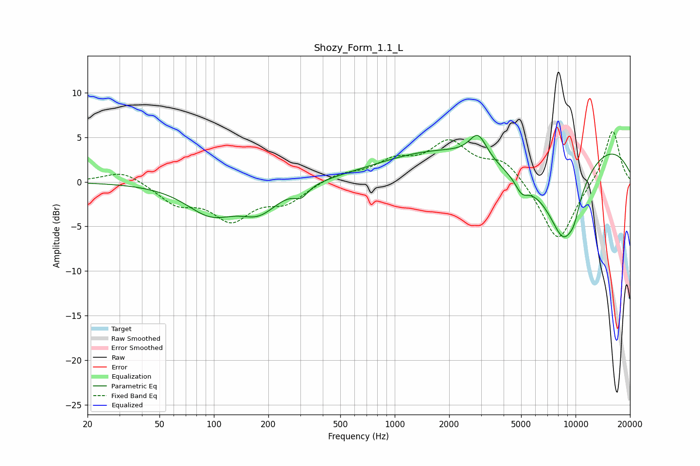

# Shozy_Form_1.1_L
See [usage instructions](https://github.com/jaakkopasanen/AutoEq#usage) for more options and info.

### Parametric EQs
Apply preamp of -5.3 dB when using parametric equalizer.

|   # | Type    |   Fc (Hz) |    Q |   Gain (dB) |
|-----|---------|-----------|------|-------------|
|   1 | Peaking |        96 | 1.04 |        -3.3 |
|   2 | Peaking |       178 | 1.34 |        -2.8 |
|   3 | Peaking |       304 | 3.71 |        -1.1 |
|   4 | Peaking |      1181 | 0.49 |         1.3 |
|   5 | Peaking |      2889 | 2.97 |         2.7 |
|   6 | Peaking |      5038 | 3.81 |        -1.4 |
|   7 | Peaking |      5997 | 0.49 |        -4.9 |
|   8 | Peaking |      7482 | 0.19 |         6.4 |
|   9 | Peaking |      8671 | 1.44 |        -8.2 |
|  10 | Peaking |      9833 | 4.58 |        -1.2 |

### Fixed Band EQs
When using fixed band (also called graphic) equalizer, apply preamp of **-5.8 dB** (if available) and set gains manually with these parameters.

|   # | Type    |   Fc (Hz) |    Q |   Gain (dB) |
|-----|---------|-----------|------|-------------|
|   1 | Peaking |        31 | 1.41 |         1.4 |
|   2 | Peaking |        62 | 1.41 |        -2.2 |
|   3 | Peaking |       125 | 1.41 |        -3.9 |
|   4 | Peaking |       250 | 1.41 |        -2.1 |
|   5 | Peaking |       500 | 1.41 |         0.9 |
|   6 | Peaking |      1000 | 1.41 |         2   |
|   7 | Peaking |      2000 | 1.41 |         4.1 |
|   8 | Peaking |      4000 | 1.41 |         2.4 |
|   9 | Peaking |      8000 | 1.41 |        -6.9 |
|  10 | Peaking |     16000 | 1.41 |         6   |

### Graphs

