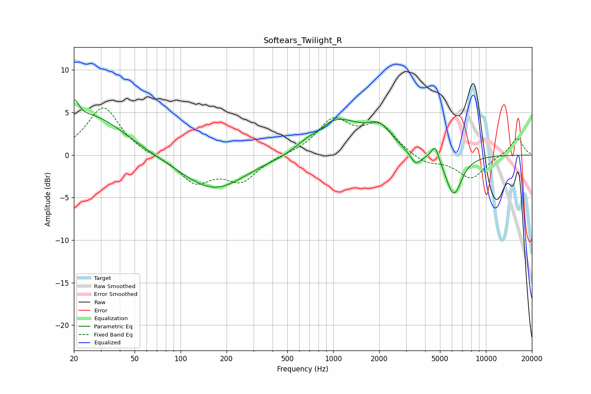

# Softears_Twilight_R
See [usage instructions](https://github.com/jaakkopasanen/AutoEq#usage) for more options and info.

### Parametric EQs
Apply preamp of -6.6 dB when using parametric equalizer.

|   # | Type    |   Fc (Hz) |    Q |   Gain (dB) |
|-----|---------|-----------|------|-------------|
|   1 | Peaking |        20 | 4.48 |         2.6 |
|   2 | Peaking |        26 | 0.67 |         4.6 |
|   3 | Peaking |       165 | 0.66 |        -4.2 |
|   4 | Peaking |       500 | 1.15 |        -0.7 |
|   5 | Peaking |       810 | 2.99 |        -0.5 |
|   6 | Peaking |      1005 | 0.75 |         4.5 |
|   7 | Peaking |      2009 | 1.97 |         2.1 |
|   8 | Peaking |      3463 | 3.7  |        -1.6 |
|   9 | Peaking |      4650 | 5.58 |         1.9 |
|  10 | Peaking |      6150 | 2.57 |        -4.8 |

### Fixed Band EQs
When using fixed band (also called graphic) equalizer, apply preamp of **-5.6 dB** (if available) and set gains manually with these parameters.

|   # | Type    |   Fc (Hz) |    Q |   Gain (dB) |
|-----|---------|-----------|------|-------------|
|   1 | Peaking |        31 | 1.41 |         5.7 |
|   2 | Peaking |        62 | 1.41 |        -0.1 |
|   3 | Peaking |       125 | 1.41 |        -3.1 |
|   4 | Peaking |       250 | 1.41 |        -2.9 |
|   5 | Peaking |       500 | 1.41 |         0   |
|   6 | Peaking |      1000 | 1.41 |         3.9 |
|   7 | Peaking |      2000 | 1.41 |         3.3 |
|   8 | Peaking |      4000 | 1.41 |        -1.1 |
|   9 | Peaking |      8000 | 1.41 |        -2.8 |
|  10 | Peaking |     16000 | 1.41 |         2.1 |

### Graphs

