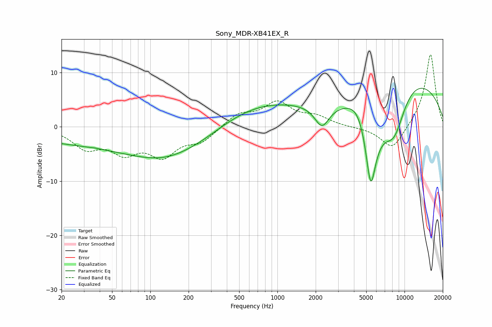

# Sony_MDR-XB41EX_R
See [usage instructions](https://github.com/jaakkopasanen/AutoEq#usage) for more options and info.

### Parametric EQs
Apply preamp of -7.2 dB when using parametric equalizer.

|   # | Type    |   Fc (Hz) |    Q |   Gain (dB) |
|-----|---------|-----------|------|-------------|
|   1 | Peaking |        24 | 0.29 |        -2.6 |
|   2 | Peaking |        37 | 5.65 |         0.1 |
|   3 | Peaking |       169 | 0.42 |        -7.5 |
|   4 | Peaking |       179 | 0.86 |         0.9 |
|   5 | Peaking |       596 | 0.34 |         5.2 |
|   6 | Peaking |      2241 | 2.45 |        -4.1 |
|   7 | Peaking |      4441 | 1.56 |         3.7 |
|   8 | Peaking |      5419 | 2.63 |       -16   |
|   9 | Peaking |      8298 | 0.88 |       -15.7 |
|  10 | Peaking |      9638 | 0.38 |        16.4 |

### Fixed Band EQs
When using fixed band (also called graphic) equalizer, apply preamp of **-13.4 dB** (if available) and set gains manually with these parameters.

|   # | Type    |   Fc (Hz) |    Q |   Gain (dB) |
|-----|---------|-----------|------|-------------|
|   1 | Peaking |        31 | 1.41 |        -3.6 |
|   2 | Peaking |        62 | 1.41 |        -4   |
|   3 | Peaking |       125 | 1.41 |        -4.8 |
|   4 | Peaking |       250 | 1.41 |        -2.5 |
|   5 | Peaking |       500 | 1.41 |         2.3 |
|   6 | Peaking |      1000 | 1.41 |         4.2 |
|   7 | Peaking |      2000 | 1.41 |         1.6 |
|   8 | Peaking |      4000 | 1.41 |        -0.1 |
|   9 | Peaking |      8000 | 1.41 |        -4.4 |
|  10 | Peaking |     16000 | 1.41 |        13.6 |

### Graphs

