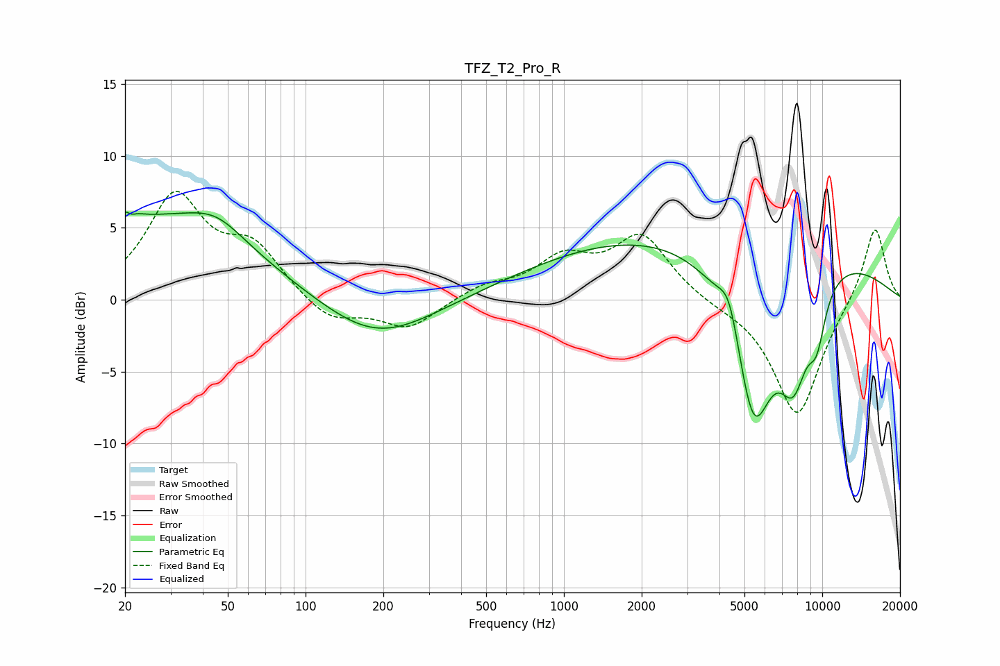

# TFZ_T2_Pro_R
See [usage instructions](https://github.com/jaakkopasanen/AutoEq#usage) for more options and info.

### Parametric EQs
Apply preamp of -6.2 dB when using parametric equalizer.

|   # | Type    |   Fc (Hz) |    Q |   Gain (dB) |
|-----|---------|-----------|------|-------------|
|   1 | Peaking |        21 | 5.08 |         3.4 |
|   2 | Peaking |        21 | 5.99 |        -2.8 |
|   3 | Peaking |        27 | 0.39 |         5.5 |
|   4 | Peaking |        45 | 1.36 |         1.4 |
|   5 | Peaking |       187 | 0.65 |        -3.1 |
|   6 | Peaking |      3948 | 0.18 |         5.1 |
|   7 | Peaking |      4373 | 3.39 |         2.8 |
|   8 | Peaking |      5418 | 1.6  |       -12.2 |
|   9 | Peaking |      7748 | 2.22 |        -6.3 |
|  10 | Peaking |      9517 | 3.53 |        -3.4 |

### Fixed Band EQs
When using fixed band (also called graphic) equalizer, apply preamp of **-7.6 dB** (if available) and set gains manually with these parameters.

|   # | Type    |   Fc (Hz) |    Q |   Gain (dB) |
|-----|---------|-----------|------|-------------|
|   1 | Peaking |        31 | 1.41 |         7   |
|   2 | Peaking |        62 | 1.41 |         3.3 |
|   3 | Peaking |       125 | 1.41 |        -1.6 |
|   4 | Peaking |       250 | 1.41 |        -2   |
|   5 | Peaking |       500 | 1.41 |         0.9 |
|   6 | Peaking |      1000 | 1.41 |         2.6 |
|   7 | Peaking |      2000 | 1.41 |         4.3 |
|   8 | Peaking |      4000 | 1.41 |        -0.3 |
|   9 | Peaking |      8000 | 1.41 |        -8.2 |
|  10 | Peaking |     16000 | 1.41 |         5.3 |

### Graphs

