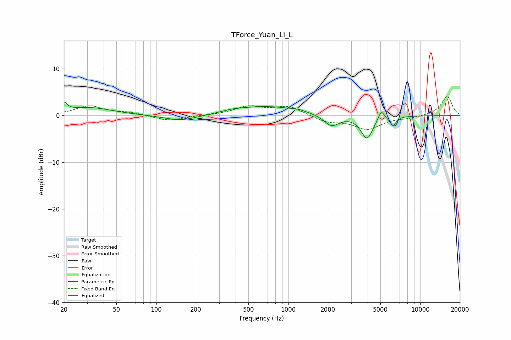

# TForce_Yuan_Li_L
See [usage instructions](https://github.com/jaakkopasanen/AutoEq#usage) for more options and info.

### Parametric EQs
Apply preamp of -3.0 dB when using parametric equalizer.

|   # | Type    |   Fc (Hz) |    Q |   Gain (dB) |
|-----|---------|-----------|------|-------------|
|   1 | Peaking |        20 | 6    |         1.8 |
|   2 | Peaking |        31 | 0.8  |         1.7 |
|   3 | Peaking |       154 | 1.13 |        -1.2 |
|   4 | Peaking |       379 | 1.6  |         0.4 |
|   5 | Peaking |       680 | 0.64 |         1.9 |
|   6 | Peaking |      1193 | 2.31 |         0.4 |
|   7 | Peaking |      2133 | 2.5  |        -2.4 |
|   8 | Peaking |      3955 | 3.12 |        -4.9 |
|   9 | Peaking |      5074 | 6    |         2.2 |
|  10 | Peaking |      6231 | 5.97 |        -1.9 |

### Fixed Band EQs
When using fixed band (also called graphic) equalizer, apply preamp of **-4.2 dB** (if available) and set gains manually with these parameters.

|   # | Type    |   Fc (Hz) |    Q |   Gain (dB) |
|-----|---------|-----------|------|-------------|
|   1 | Peaking |        31 | 1.41 |         2   |
|   2 | Peaking |        62 | 1.41 |         0.5 |
|   3 | Peaking |       125 | 1.41 |        -1.2 |
|   4 | Peaking |       250 | 1.41 |         0   |
|   5 | Peaking |       500 | 1.41 |         1.8 |
|   6 | Peaking |      1000 | 1.41 |         1.9 |
|   7 | Peaking |      2000 | 1.41 |        -1.3 |
|   8 | Peaking |      4000 | 1.41 |        -2.8 |
|   9 | Peaking |      8000 | 1.41 |        -0.4 |
|  10 | Peaking |     16000 | 1.41 |         4.1 |

### Graphs

