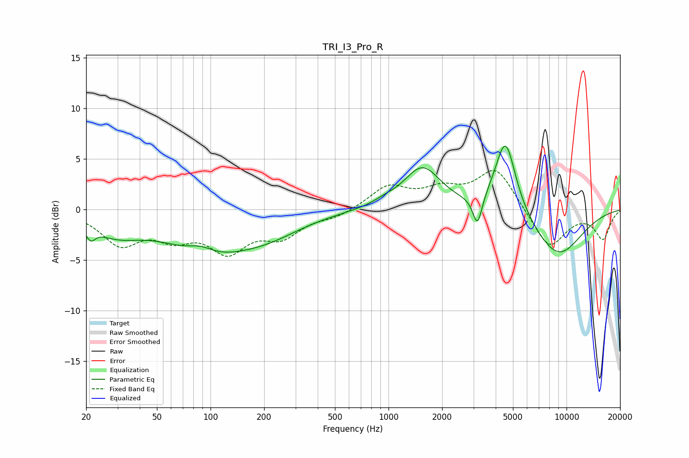

# TRI_I3_Pro_R
See [usage instructions](https://github.com/jaakkopasanen/AutoEq#usage) for more options and info.

### Parametric EQs
Apply preamp of -6.4 dB when using parametric equalizer.

|   # | Type    |   Fc (Hz) |    Q |   Gain (dB) |
|-----|---------|-----------|------|-------------|
|   1 | Peaking |        21 | 5.37 |        -1.3 |
|   2 | Peaking |        29 | 1.03 |        -1.9 |
|   3 | Peaking |        88 | 1.92 |         0.9 |
|   4 | Peaking |        97 | 0.57 |        -3.9 |
|   5 | Peaking |       218 | 0.74 |        -1.4 |
|   6 | Peaking |       949 | 2.11 |         0.4 |
|   7 | Peaking |      1548 | 1.37 |         4.1 |
|   8 | Peaking |      3160 | 5.45 |        -3   |
|   9 | Peaking |      4542 | 2.36 |         7.5 |
|  10 | Peaking |      8924 | 0.89 |        -4.7 |

### Fixed Band EQs
When using fixed band (also called graphic) equalizer, apply preamp of **-4.0 dB** (if available) and set gains manually with these parameters.

|   # | Type    |   Fc (Hz) |    Q |   Gain (dB) |
|-----|---------|-----------|------|-------------|
|   1 | Peaking |        31 | 1.41 |        -3.2 |
|   2 | Peaking |        62 | 1.41 |        -2.2 |
|   3 | Peaking |       125 | 1.41 |        -3.7 |
|   4 | Peaking |       250 | 1.41 |        -2.3 |
|   5 | Peaking |       500 | 1.41 |        -0.7 |
|   6 | Peaking |      1000 | 1.41 |         2.2 |
|   7 | Peaking |      2000 | 1.41 |         1.7 |
|   8 | Peaking |      4000 | 1.41 |         4.1 |
|   9 | Peaking |      8000 | 1.41 |        -3.9 |
|  10 | Peaking |     16000 | 1.41 |        -2.8 |

### Graphs

