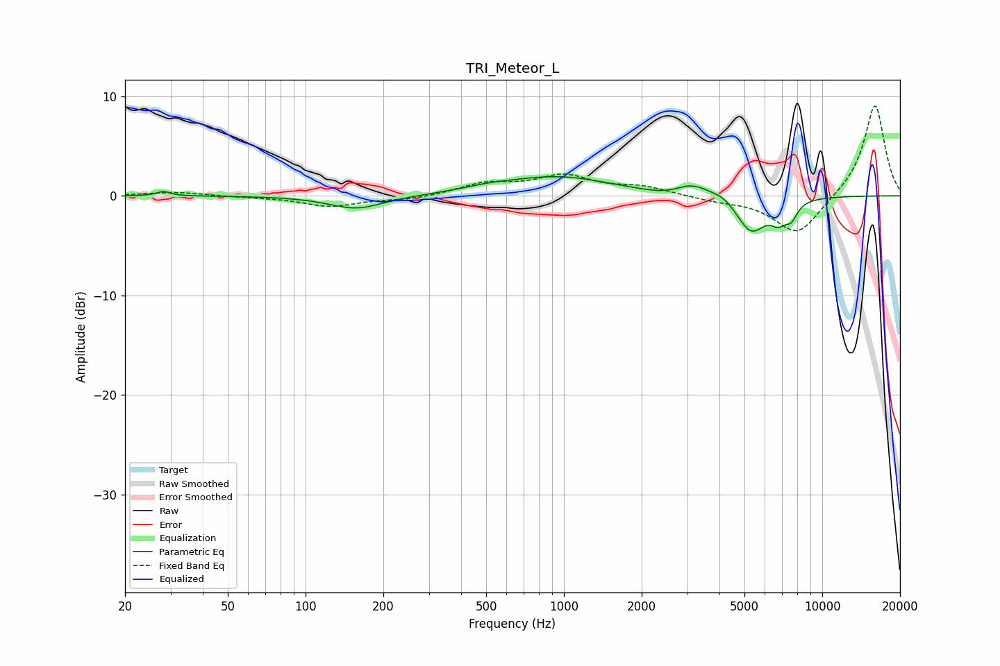

# TRI_Meteor_L
See [usage instructions](https://github.com/jaakkopasanen/AutoEq#usage) for more options and info.

### Parametric EQs
Apply preamp of -2.0 dB when using parametric equalizer.

|   # | Type    |   Fc (Hz) |    Q |   Gain (dB) |
|-----|---------|-----------|------|-------------|
|   1 | Peaking |        28 | 5.64 |         0.4 |
|   2 | Peaking |       157 | 1.35 |        -1.3 |
|   3 | Peaking |       508 | 1.4  |         0.3 |
|   4 | Peaking |       947 | 0.68 |         1.9 |
|   5 | Peaking |      2539 | 1.69 |        -0.5 |
|   6 | Peaking |      3131 | 1.98 |         1.3 |
|   7 | Peaking |      4154 | 3.46 |         0.5 |
|   8 | Peaking |      5306 | 2.43 |        -3.6 |
|   9 | Peaking |      6777 | 4.31 |        -1.7 |
|  10 | Peaking |      7598 | 5.66 |        -1.4 |

### Fixed Band EQs
When using fixed band (also called graphic) equalizer, apply preamp of **-9.1 dB** (if available) and set gains manually with these parameters.

|   # | Type    |   Fc (Hz) |    Q |   Gain (dB) |
|-----|---------|-----------|------|-------------|
|   1 | Peaking |        31 | 1.41 |         0.4 |
|   2 | Peaking |        62 | 1.41 |        -0.1 |
|   3 | Peaking |       125 | 1.41 |        -1   |
|   4 | Peaking |       250 | 1.41 |        -0.4 |
|   5 | Peaking |       500 | 1.41 |         1.1 |
|   6 | Peaking |      1000 | 1.41 |         1.9 |
|   7 | Peaking |      2000 | 1.41 |         0.8 |
|   8 | Peaking |      4000 | 1.41 |        -0.4 |
|   9 | Peaking |      8000 | 1.41 |        -4   |
|  10 | Peaking |     16000 | 1.41 |         9.3 |

### Graphs

