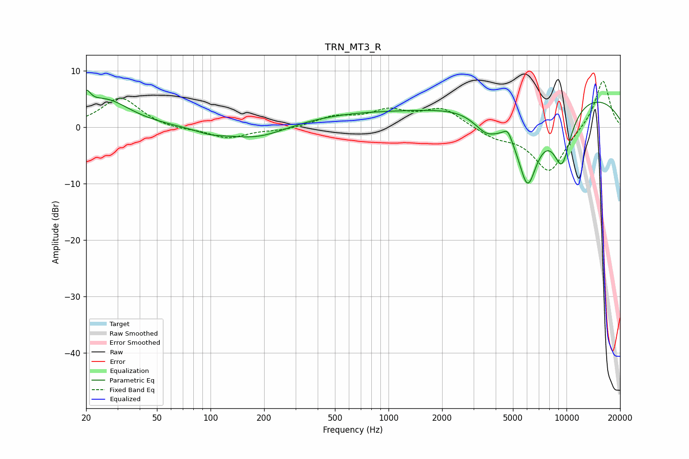

# TRN_MT3_R
See [usage instructions](https://github.com/jaakkopasanen/AutoEq#usage) for more options and info.

### Parametric EQs
Apply preamp of -6.6 dB when using parametric equalizer.

|   # | Type    |   Fc (Hz) |    Q |   Gain (dB) |
|-----|---------|-----------|------|-------------|
|   1 | Peaking |        20 | 5.92 |         2.8 |
|   2 | Peaking |        26 | 1.03 |         4.8 |
|   3 | Peaking |       100 | 1.67 |        -0.8 |
|   4 | Peaking |       182 | 0.8  |        -2.6 |
|   5 | Peaking |       624 | 0.36 |         2.3 |
|   6 | Peaking |      3558 | 1.86 |        -3.7 |
|   7 | Peaking |      4680 | 5.79 |         1.8 |
|   8 | Peaking |      6045 | 1.99 |       -14.4 |
|   9 | Peaking |      8916 | 0.22 |         6.7 |
|  10 | Peaking |      9425 | 2.21 |       -10.2 |

### Fixed Band EQs
When using fixed band (also called graphic) equalizer, apply preamp of **-8.2 dB** (if available) and set gains manually with these parameters.

|   # | Type    |   Fc (Hz) |    Q |   Gain (dB) |
|-----|---------|-----------|------|-------------|
|   1 | Peaking |        31 | 1.41 |         5.3 |
|   2 | Peaking |        62 | 1.41 |        -0.5 |
|   3 | Peaking |       125 | 1.41 |        -2   |
|   4 | Peaking |       250 | 1.41 |        -0.5 |
|   5 | Peaking |       500 | 1.41 |         1.7 |
|   6 | Peaking |      1000 | 1.41 |         2.6 |
|   7 | Peaking |      2000 | 1.41 |         3.2 |
|   8 | Peaking |      4000 | 1.41 |        -1.6 |
|   9 | Peaking |      8000 | 1.41 |        -8   |
|  10 | Peaking |     16000 | 1.41 |         8.6 |

### Graphs

