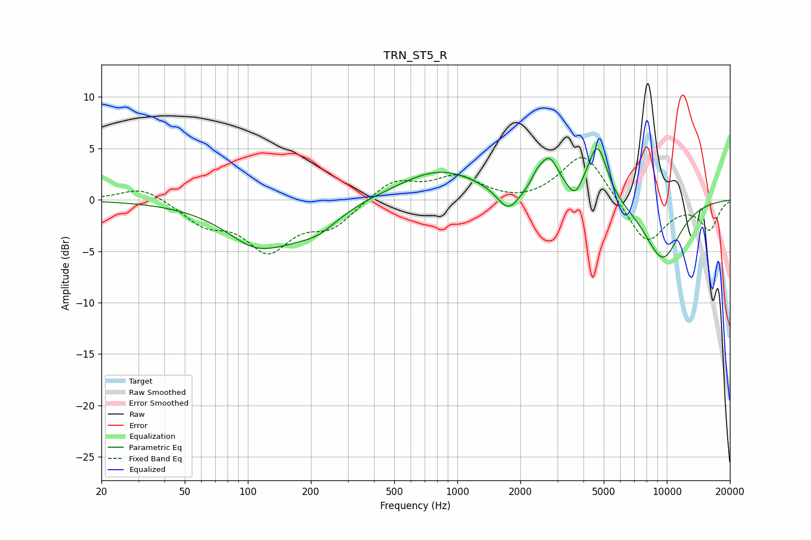

# TRN_ST5_R
See [usage instructions](https://github.com/jaakkopasanen/AutoEq#usage) for more options and info.

### Parametric EQs
Apply preamp of -5.1 dB when using parametric equalizer.

|   # | Type    |   Fc (Hz) |    Q |   Gain (dB) |
|-----|---------|-----------|------|-------------|
|   1 | Peaking |       118 | 0.88 |        -4.8 |
|   2 | Peaking |       126 | 2.05 |         0.4 |
|   3 | Peaking |       216 | 1.36 |        -1.8 |
|   4 | Peaking |       823 | 0.72 |         2.9 |
|   5 | Peaking |      1748 | 2.72 |        -2.2 |
|   6 | Peaking |      2399 | 5.01 |         0.9 |
|   7 | Peaking |      2748 | 3.09 |         3.4 |
|   8 | Peaking |      3637 | 4.69 |        -1.3 |
|   9 | Peaking |      4670 | 2.99 |         5.5 |
|  10 | Peaking |      9534 | 1.41 |        -5.8 |

### Fixed Band EQs
When using fixed band (also called graphic) equalizer, apply preamp of **-4.2 dB** (if available) and set gains manually with these parameters.

|   # | Type    |   Fc (Hz) |    Q |   Gain (dB) |
|-----|---------|-----------|------|-------------|
|   1 | Peaking |        31 | 1.41 |         1.4 |
|   2 | Peaking |        62 | 1.41 |        -2.1 |
|   3 | Peaking |       125 | 1.41 |        -4.6 |
|   4 | Peaking |       250 | 1.41 |        -2.4 |
|   5 | Peaking |       500 | 1.41 |         2   |
|   6 | Peaking |      1000 | 1.41 |         2.1 |
|   7 | Peaking |      2000 | 1.41 |        -0.4 |
|   8 | Peaking |      4000 | 1.41 |         4.8 |
|   9 | Peaking |      8000 | 1.41 |        -4.4 |
|  10 | Peaking |     16000 | 1.41 |        -2.8 |

### Graphs

