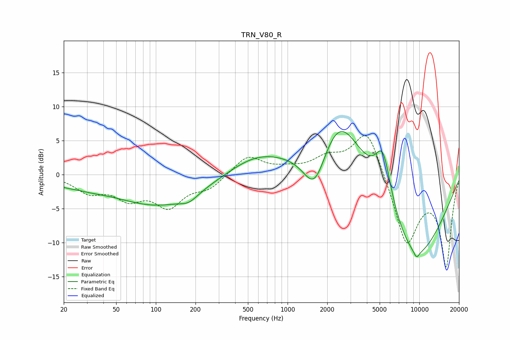

# TRN_V80_R
See [usage instructions](https://github.com/jaakkopasanen/AutoEq#usage) for more options and info.

### Parametric EQs
Apply preamp of -6.4 dB when using parametric equalizer.

|   # | Type    |   Fc (Hz) |    Q |   Gain (dB) |
|-----|---------|-----------|------|-------------|
|   1 | Peaking |        20 | 1.97 |        -0.5 |
|   2 | Peaking |        30 | 0.89 |        -0.9 |
|   3 | Peaking |       105 | 0.43 |        -4.4 |
|   4 | Peaking |       178 | 2.1  |        -1   |
|   5 | Peaking |       575 | 0.66 |         2.5 |
|   6 | Peaking |      1608 | 1.49 |        -7.5 |
|   7 | Peaking |      2459 | 0.72 |        11.4 |
|   8 | Peaking |      5297 | 2.21 |         7.7 |
|   9 | Peaking |      9093 | 0.48 |       -13   |
|  10 | Peaking |      9526 | 5.87 |        -1   |

### Fixed Band EQs
When using fixed band (also called graphic) equalizer, apply preamp of **-5.8 dB** (if available) and set gains manually with these parameters.

|   # | Type    |   Fc (Hz) |    Q |   Gain (dB) |
|-----|---------|-----------|------|-------------|
|   1 | Peaking |        31 | 1.41 |        -2.3 |
|   2 | Peaking |        62 | 1.41 |        -3   |
|   3 | Peaking |       125 | 1.41 |        -4.3 |
|   4 | Peaking |       250 | 1.41 |        -1.8 |
|   5 | Peaking |       500 | 1.41 |         2.8 |
|   6 | Peaking |      1000 | 1.41 |         0.6 |
|   7 | Peaking |      2000 | 1.41 |         2.1 |
|   8 | Peaking |      4000 | 1.41 |         7.1 |
|   9 | Peaking |      8000 | 1.41 |       -10.3 |
|  10 | Peaking |     16000 | 1.41 |       -13.2 |

### Graphs

