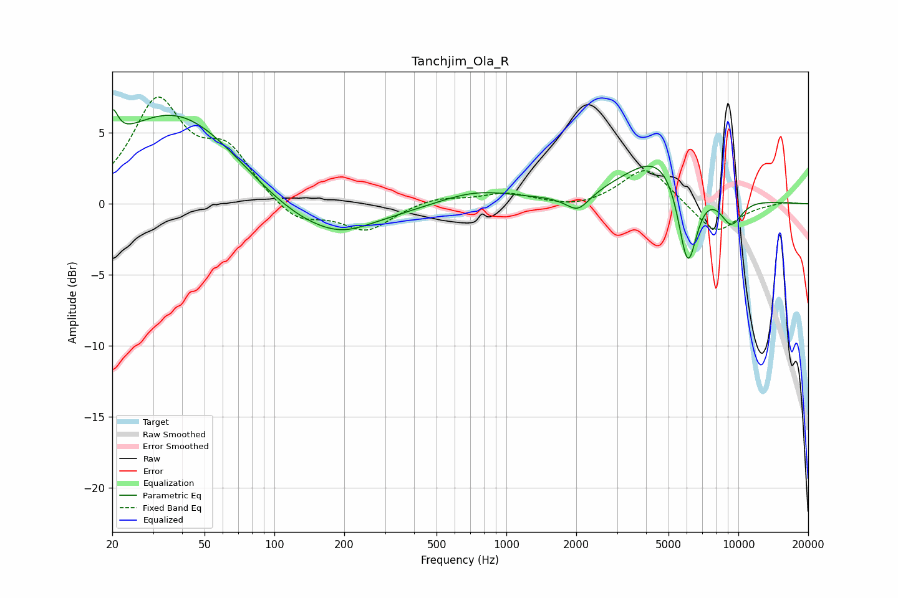

# Tanchjim_Ola_R
See [usage instructions](https://github.com/jaakkopasanen/AutoEq#usage) for more options and info.

### Parametric EQs
Apply preamp of -6.7 dB when using parametric equalizer.

|   # | Type    |   Fc (Hz) |    Q |   Gain (dB) |
|-----|---------|-----------|------|-------------|
|   1 | Peaking |        20 | 6    |         2.2 |
|   2 | Peaking |        38 | 0.48 |         6.8 |
|   3 | Peaking |       141 | 0.53 |        -2.8 |
|   4 | Peaking |       198 | 1.33 |        -0.5 |
|   5 | Peaking |       738 | 0.88 |         1   |
|   6 | Peaking |      1897 | 4.23 |         0.1 |
|   7 | Peaking |      2018 | 2.67 |        -1.4 |
|   8 | Peaking |      4892 | 0.84 |         4   |
|   9 | Peaking |      6044 | 3.16 |        -7   |
|  10 | Peaking |      9293 | 2.45 |        -2.2 |

### Fixed Band EQs
When using fixed band (also called graphic) equalizer, apply preamp of **-7.6 dB** (if available) and set gains manually with these parameters.

|   # | Type    |   Fc (Hz) |    Q |   Gain (dB) |
|-----|---------|-----------|------|-------------|
|   1 | Peaking |        31 | 1.41 |         7   |
|   2 | Peaking |        62 | 1.41 |         3.4 |
|   3 | Peaking |       125 | 1.41 |        -1.4 |
|   4 | Peaking |       250 | 1.41 |        -1.9 |
|   5 | Peaking |       500 | 1.41 |         0.5 |
|   6 | Peaking |      1000 | 1.41 |         0.7 |
|   7 | Peaking |      2000 | 1.41 |        -0.4 |
|   8 | Peaking |      4000 | 1.41 |         2.7 |
|   9 | Peaking |      8000 | 1.41 |        -2.2 |
|  10 | Peaking |     16000 | 1.41 |         0.2 |

### Graphs

