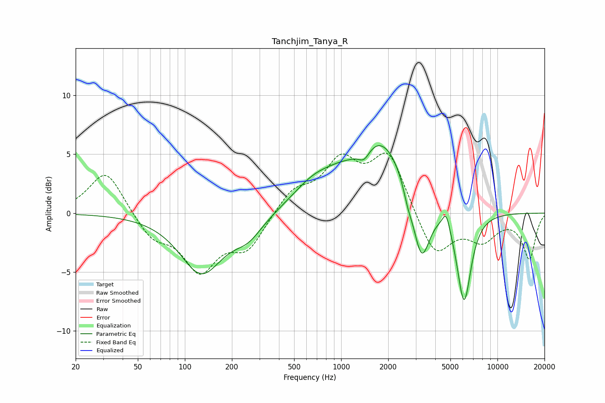

# Tanchjim_Tanya_R
See [usage instructions](https://github.com/jaakkopasanen/AutoEq#usage) for more options and info.

### Parametric EQs
Apply preamp of -5.8 dB when using parametric equalizer.

|   # | Type    |   Fc (Hz) |    Q |   Gain (dB) |
|-----|---------|-----------|------|-------------|
|   1 | Peaking |       127 | 1.04 |        -5   |
|   2 | Peaking |       254 | 1.46 |        -1.6 |
|   3 | Peaking |       681 | 0.98 |         2.1 |
|   4 | Peaking |       969 | 1.64 |         0.5 |
|   5 | Peaking |      1403 | 3.88 |        -1   |
|   6 | Peaking |      1816 | 0.83 |         6.2 |
|   7 | Peaking |      2671 | 5.01 |        -1   |
|   8 | Peaking |      3261 | 2.56 |        -5.8 |
|   9 | Peaking |      4699 | 5.99 |         1.5 |
|  10 | Peaking |      6114 | 3.01 |        -7.8 |

### Fixed Band EQs
When using fixed band (also called graphic) equalizer, apply preamp of **-5.2 dB** (if available) and set gains manually with these parameters.

|   # | Type    |   Fc (Hz) |    Q |   Gain (dB) |
|-----|---------|-----------|------|-------------|
|   1 | Peaking |        31 | 1.41 |         3.7 |
|   2 | Peaking |        62 | 1.41 |        -2   |
|   3 | Peaking |       125 | 1.41 |        -4.6 |
|   4 | Peaking |       250 | 1.41 |        -2.8 |
|   5 | Peaking |       500 | 1.41 |         1.9 |
|   6 | Peaking |      1000 | 1.41 |         4   |
|   7 | Peaking |      2000 | 1.41 |         5   |
|   8 | Peaking |      4000 | 1.41 |        -3.8 |
|   9 | Peaking |      8000 | 1.41 |        -2.1 |
|  10 | Peaking |     16000 | 1.41 |        -3.8 |

### Graphs

