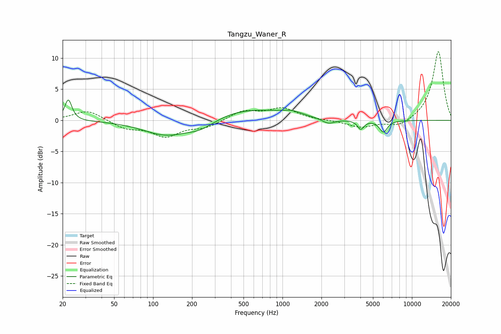

# Tangzu_Waner_R
See [usage instructions](https://github.com/jaakkopasanen/AutoEq#usage) for more options and info.

### Parametric EQs
Apply preamp of -3.4 dB when using parametric equalizer.

|   # | Type    |   Fc (Hz) |    Q |   Gain (dB) |
|-----|---------|-----------|------|-------------|
|   1 | Peaking |        22 | 5.29 |         3.4 |
|   2 | Peaking |       127 | 0.8  |        -2.4 |
|   3 | Peaking |       160 | 1.18 |         0   |
|   4 | Peaking |       233 | 1.31 |        -1.3 |
|   5 | Peaking |       274 | 1.36 |        -0.1 |
|   6 | Peaking |       544 | 0.51 |         1.9 |
|   7 | Peaking |      1186 | 1.83 |         0.6 |
|   8 | Peaking |      2261 | 2.86 |        -0.8 |
|   9 | Peaking |      4022 | 5.77 |        -1.4 |
|  10 | Peaking |      6020 | 4.51 |        -1.9 |

### Fixed Band EQs
When using fixed band (also called graphic) equalizer, apply preamp of **-11.1 dB** (if available) and set gains manually with these parameters.

|   # | Type    |   Fc (Hz) |    Q |   Gain (dB) |
|-----|---------|-----------|------|-------------|
|   1 | Peaking |        31 | 1.41 |         1.7 |
|   2 | Peaking |        62 | 1.41 |        -1.2 |
|   3 | Peaking |       125 | 1.41 |        -2.4 |
|   4 | Peaking |       250 | 1.41 |        -1.1 |
|   5 | Peaking |       500 | 1.41 |         1.5 |
|   6 | Peaking |      1000 | 1.41 |         1.9 |
|   7 | Peaking |      2000 | 1.41 |        -0   |
|   8 | Peaking |      4000 | 1.41 |        -1.1 |
|   9 | Peaking |      8000 | 1.41 |        -1.1 |
|  10 | Peaking |     16000 | 1.41 |        11.2 |

### Graphs

