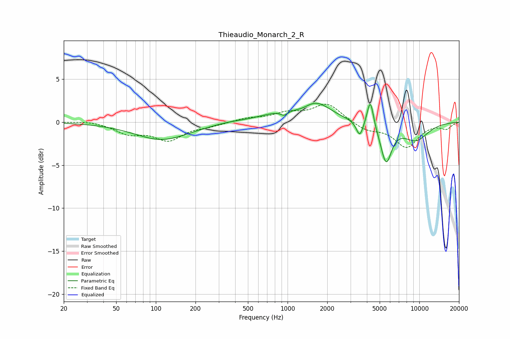

# Thieaudio_Monarch_2_R
See [usage instructions](https://github.com/jaakkopasanen/AutoEq#usage) for more options and info.

### Parametric EQs
Apply preamp of -2.3 dB when using parametric equalizer.

|   # | Type    |   Fc (Hz) |    Q |   Gain (dB) |
|-----|---------|-----------|------|-------------|
|   1 | Peaking |       111 | 0.68 |        -2   |
|   2 | Peaking |       356 | 1.35 |         0.2 |
|   3 | Peaking |       837 | 0.91 |         0.8 |
|   4 | Peaking |       941 | 5.52 |        -0.5 |
|   5 | Peaking |      1313 | 2.33 |        -0.3 |
|   6 | Peaking |      1634 | 1.23 |         2.2 |
|   7 | Peaking |      3532 | 5.48 |        -1.8 |
|   8 | Peaking |      4245 | 5.84 |         3.3 |
|   9 | Peaking |      5596 | 3.31 |        -4.4 |
|  10 | Peaking |      9409 | 1.28 |        -2   |

### Fixed Band EQs
When using fixed band (also called graphic) equalizer, apply preamp of **-2.2 dB** (if available) and set gains manually with these parameters.

|   # | Type    |   Fc (Hz) |    Q |   Gain (dB) |
|-----|---------|-----------|------|-------------|
|   1 | Peaking |        31 | 1.41 |         0.2 |
|   2 | Peaking |        62 | 1.41 |        -1.2 |
|   3 | Peaking |       125 | 1.41 |        -2   |
|   4 | Peaking |       250 | 1.41 |        -0.4 |
|   5 | Peaking |       500 | 1.41 |         0.4 |
|   6 | Peaking |      1000 | 1.41 |         0.9 |
|   7 | Peaking |      2000 | 1.41 |         2.1 |
|   8 | Peaking |      4000 | 1.41 |        -0.9 |
|   9 | Peaking |      8000 | 1.41 |        -2.8 |
|  10 | Peaking |     16000 | 1.41 |        -0.7 |

### Graphs

