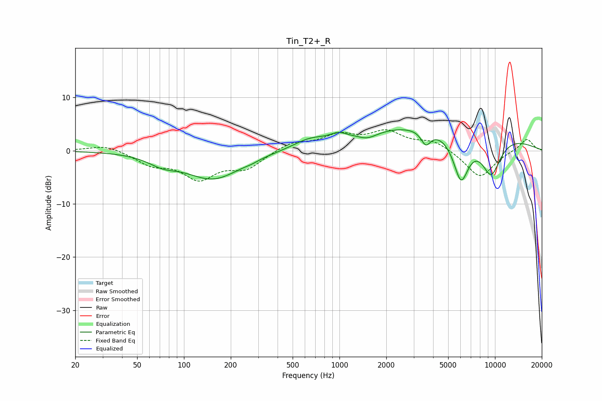

# Tin_T2+_R
See [usage instructions](https://github.com/jaakkopasanen/AutoEq#usage) for more options and info.

### Parametric EQs
Apply preamp of -4.0 dB when using parametric equalizer.

|   # | Type    |   Fc (Hz) |    Q |   Gain (dB) |
|-----|---------|-----------|------|-------------|
|   1 | Peaking |        73 | 1.56 |        -1.5 |
|   2 | Peaking |       154 | 0.79 |        -5.3 |
|   3 | Peaking |       272 | 3.46 |        -0.2 |
|   4 | Peaking |       636 | 1.41 |         1.4 |
|   5 | Peaking |       983 | 2.85 |         1   |
|   6 | Peaking |      1515 | 2.19 |        -1.3 |
|   7 | Peaking |      3593 | 4.48 |        -2.7 |
|   8 | Peaking |      4482 | 0.23 |         5.2 |
|   9 | Peaking |      6048 | 2.59 |        -9   |
|  10 | Peaking |      9443 | 1.89 |        -7.7 |

### Fixed Band EQs
When using fixed band (also called graphic) equalizer, apply preamp of **-4.0 dB** (if available) and set gains manually with these parameters.

|   # | Type    |   Fc (Hz) |    Q |   Gain (dB) |
|-----|---------|-----------|------|-------------|
|   1 | Peaking |        31 | 1.41 |         1.2 |
|   2 | Peaking |        62 | 1.41 |        -2.3 |
|   3 | Peaking |       125 | 1.41 |        -4.9 |
|   4 | Peaking |       250 | 1.41 |        -3.1 |
|   5 | Peaking |       500 | 1.41 |         1.6 |
|   6 | Peaking |      1000 | 1.41 |         2.7 |
|   7 | Peaking |      2000 | 1.41 |         3.2 |
|   8 | Peaking |      4000 | 1.41 |         1.8 |
|   9 | Peaking |      8000 | 1.41 |        -5.1 |
|  10 | Peaking |     16000 | 1.41 |         2.3 |

### Graphs

