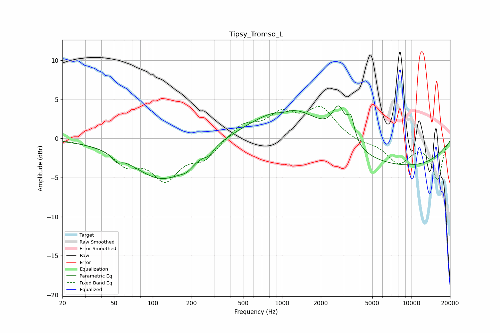

# Tipsy_Tromso_L
See [usage instructions](https://github.com/jaakkopasanen/AutoEq#usage) for more options and info.

### Parametric EQs
Apply preamp of -4.3 dB when using parametric equalizer.

|   # | Type    |   Fc (Hz) |    Q |   Gain (dB) |
|-----|---------|-----------|------|-------------|
|   1 | Peaking |        53 | 4.72 |        -0.8 |
|   2 | Peaking |       119 | 0.61 |        -5.2 |
|   3 | Peaking |       184 | 2.73 |        -0.7 |
|   4 | Peaking |       272 | 4.14 |        -0.7 |
|   5 | Peaking |      1013 | 2.93 |        -0.4 |
|   6 | Peaking |      1276 | 0.6  |         2.9 |
|   7 | Peaking |      2750 | 2.87 |         4   |
|   8 | Peaking |      3148 | 0.18 |         4.1 |
|   9 | Peaking |      3420 | 5.27 |         2.8 |
|  10 | Peaking |      6133 | 0.25 |        -7.1 |

### Fixed Band EQs
When using fixed band (also called graphic) equalizer, apply preamp of **-4.2 dB** (if available) and set gains manually with these parameters.

|   # | Type    |   Fc (Hz) |    Q |   Gain (dB) |
|-----|---------|-----------|------|-------------|
|   1 | Peaking |        31 | 1.41 |        -0.2 |
|   2 | Peaking |        62 | 1.41 |        -2.8 |
|   3 | Peaking |       125 | 1.41 |        -4.8 |
|   4 | Peaking |       250 | 1.41 |        -2.3 |
|   5 | Peaking |       500 | 1.41 |         1.8 |
|   6 | Peaking |      1000 | 1.41 |         2.9 |
|   7 | Peaking |      2000 | 1.41 |         3.7 |
|   8 | Peaking |      4000 | 1.41 |        -0.5 |
|   9 | Peaking |      8000 | 1.41 |        -3   |
|  10 | Peaking |     16000 | 1.41 |        -5.1 |

### Graphs

