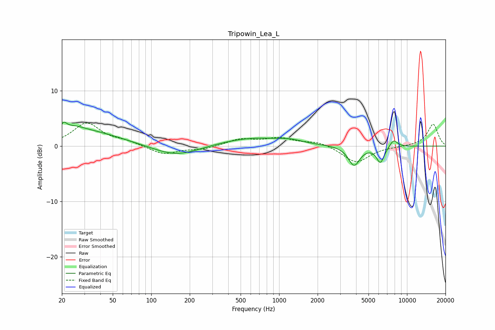

# Tripowin_Lea_L
See [usage instructions](https://github.com/jaakkopasanen/AutoEq#usage) for more options and info.

### Parametric EQs
Apply preamp of -4.4 dB when using parametric equalizer.

|   # | Type    |   Fc (Hz) |    Q |   Gain (dB) |
|-----|---------|-----------|------|-------------|
|   1 | Peaking |        21 | 5.92 |         3.1 |
|   2 | Peaking |        21 | 6    |        -1.8 |
|   3 | Peaking |        25 | 1.95 |         0.8 |
|   4 | Peaking |        28 | 0.49 |         2.8 |
|   5 | Peaking |       156 | 0.79 |        -2   |
|   6 | Peaking |       621 | 0.54 |         1.5 |
|   7 | Peaking |      1228 | 1.7  |         0.5 |
|   8 | Peaking |      3855 | 3.11 |        -3.5 |
|   9 | Peaking |      6194 | 4.48 |        -2.9 |
|  10 | Peaking |      7851 | 4.31 |         1.4 |

### Fixed Band EQs
When using fixed band (also called graphic) equalizer, apply preamp of **-4.3 dB** (if available) and set gains manually with these parameters.

|   # | Type    |   Fc (Hz) |    Q |   Gain (dB) |
|-----|---------|-----------|------|-------------|
|   1 | Peaking |        31 | 1.41 |         4.1 |
|   2 | Peaking |        62 | 1.41 |         0.7 |
|   3 | Peaking |       125 | 1.41 |        -1.5 |
|   4 | Peaking |       250 | 1.41 |        -0.6 |
|   5 | Peaking |       500 | 1.41 |         1.2 |
|   6 | Peaking |      1000 | 1.41 |         1.3 |
|   7 | Peaking |      2000 | 1.41 |         0.8 |
|   8 | Peaking |      4000 | 1.41 |        -3   |
|   9 | Peaking |      8000 | 1.41 |        -0.1 |
|  10 | Peaking |     16000 | 1.41 |         4   |

### Graphs

