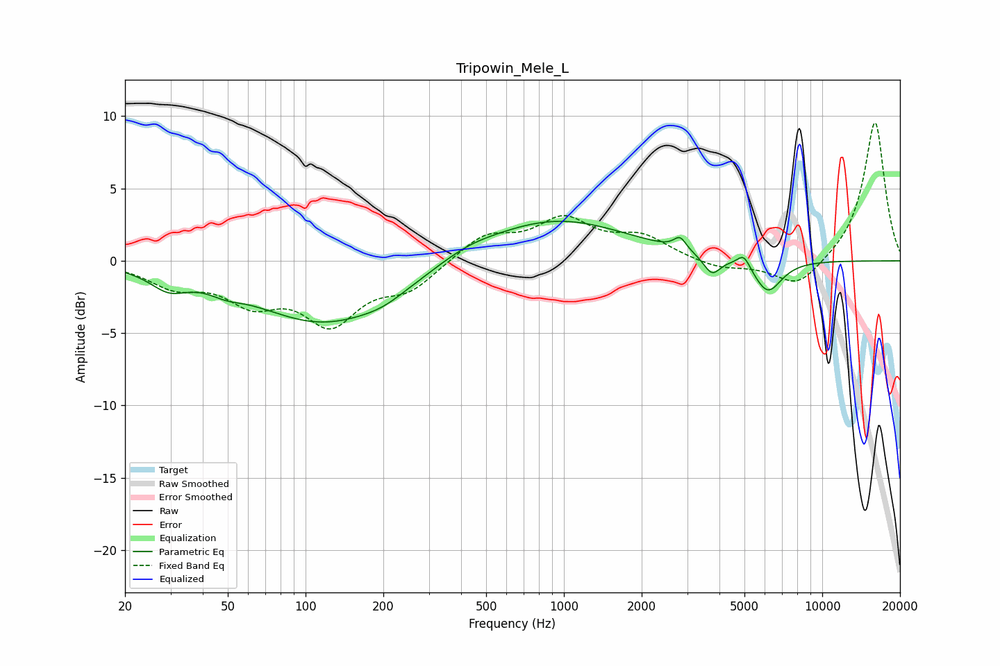

# Tripowin_Mele_L
See [usage instructions](https://github.com/jaakkopasanen/AutoEq#usage) for more options and info.

### Parametric EQs
Apply preamp of -2.8 dB when using parametric equalizer.

|   # | Type    |   Fc (Hz) |    Q |   Gain (dB) |
|-----|---------|-----------|------|-------------|
|   1 | Peaking |        29 | 1.99 |        -1.2 |
|   2 | Peaking |        49 | 2.35 |        -0.5 |
|   3 | Peaking |       119 | 0.51 |        -4.3 |
|   4 | Peaking |       201 | 1.6  |        -0.5 |
|   5 | Peaking |       422 | 1.32 |         0.5 |
|   6 | Peaking |       918 | 0.5  |         2.9 |
|   7 | Peaking |      2816 | 5.88 |         0.9 |
|   8 | Peaking |      3740 | 4.27 |        -1.3 |
|   9 | Peaking |      4972 | 5.56 |         0.9 |
|  10 | Peaking |      6152 | 2.51 |        -2.3 |

### Fixed Band EQs
When using fixed band (also called graphic) equalizer, apply preamp of **-9.6 dB** (if available) and set gains manually with these parameters.

|   # | Type    |   Fc (Hz) |    Q |   Gain (dB) |
|-----|---------|-----------|------|-------------|
|   1 | Peaking |        31 | 1.41 |        -1.5 |
|   2 | Peaking |        62 | 1.41 |        -2.4 |
|   3 | Peaking |       125 | 1.41 |        -4   |
|   4 | Peaking |       250 | 1.41 |        -1.8 |
|   5 | Peaking |       500 | 1.41 |         1.7 |
|   6 | Peaking |      1000 | 1.41 |         2.7 |
|   7 | Peaking |      2000 | 1.41 |         1.5 |
|   8 | Peaking |      4000 | 1.41 |        -0.6 |
|   9 | Peaking |      8000 | 1.41 |        -1.9 |
|  10 | Peaking |     16000 | 1.41 |         9.7 |

### Graphs

