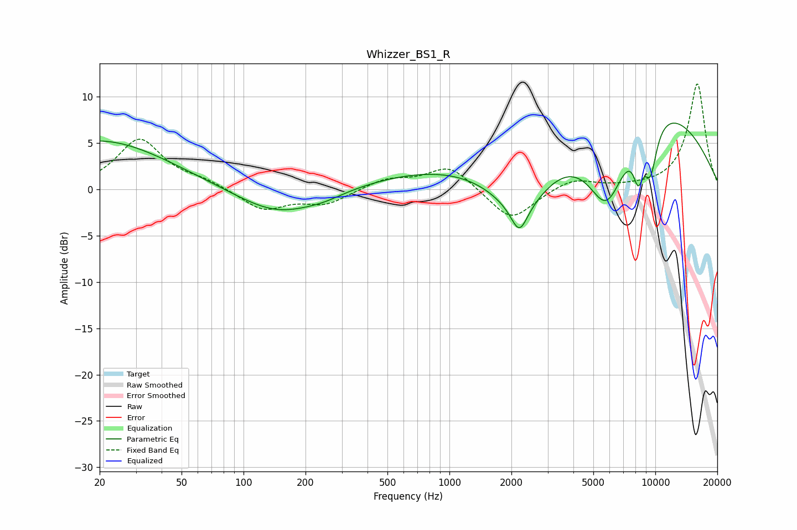

# Whizzer_BS1_R
See [usage instructions](https://github.com/jaakkopasanen/AutoEq#usage) for more options and info.

### Parametric EQs
Apply preamp of -7.2 dB when using parametric equalizer.

|   # | Type    |   Fc (Hz) |    Q |   Gain (dB) |
|-----|---------|-----------|------|-------------|
|   1 | Peaking |        20 | 0.42 |         5.3 |
|   2 | Peaking |       147 | 0.71 |        -2.9 |
|   3 | Peaking |       248 | 1.53 |        -0.4 |
|   4 | Peaking |      2046 | 0.22 |         3.1 |
|   5 | Peaking |      2185 | 3.69 |        -2.9 |
|   6 | Peaking |      2243 | 0.89 |        -6.5 |
|   7 | Peaking |      5811 | 1.28 |       -10.2 |
|   8 | Peaking |      8262 | 5.29 |        -3.8 |
|   9 | Peaking |      8726 | 0.33 |         9.5 |
|  10 | Peaking |      9467 | 3.8  |        -5.2 |

### Fixed Band EQs
When using fixed band (also called graphic) equalizer, apply preamp of **-11.5 dB** (if available) and set gains manually with these parameters.

|   # | Type    |   Fc (Hz) |    Q |   Gain (dB) |
|-----|---------|-----------|------|-------------|
|   1 | Peaking |        31 | 1.41 |         5.4 |
|   2 | Peaking |        62 | 1.41 |         0.8 |
|   3 | Peaking |       125 | 1.41 |        -2.2 |
|   4 | Peaking |       250 | 1.41 |        -1.5 |
|   5 | Peaking |       500 | 1.41 |         1.1 |
|   6 | Peaking |      1000 | 1.41 |         2.6 |
|   7 | Peaking |      2000 | 1.41 |        -3.5 |
|   8 | Peaking |      4000 | 1.41 |         1.2 |
|   9 | Peaking |      8000 | 1.41 |         0.1 |
|  10 | Peaking |     16000 | 1.41 |        11.5 |

### Graphs

